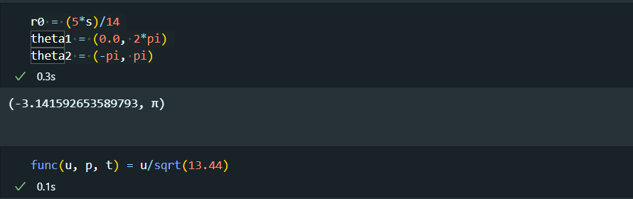
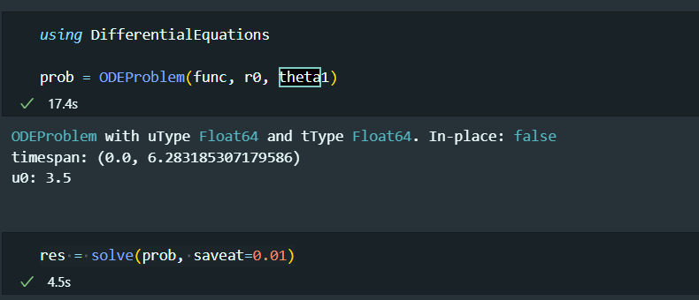
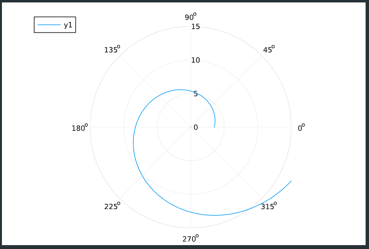
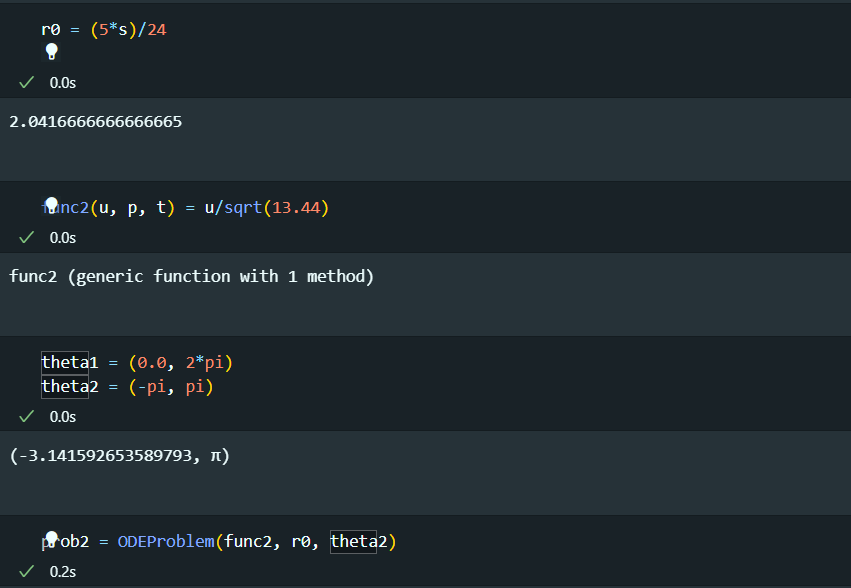
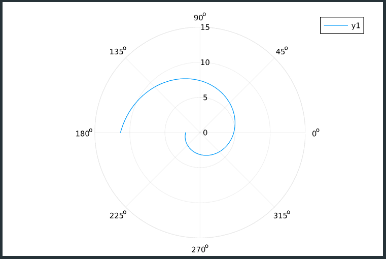
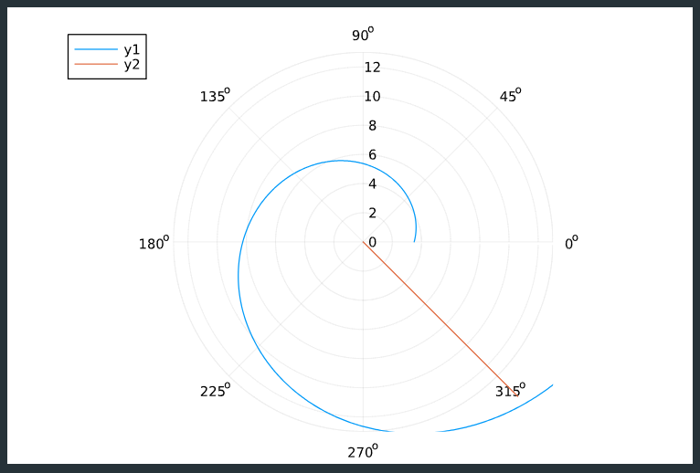
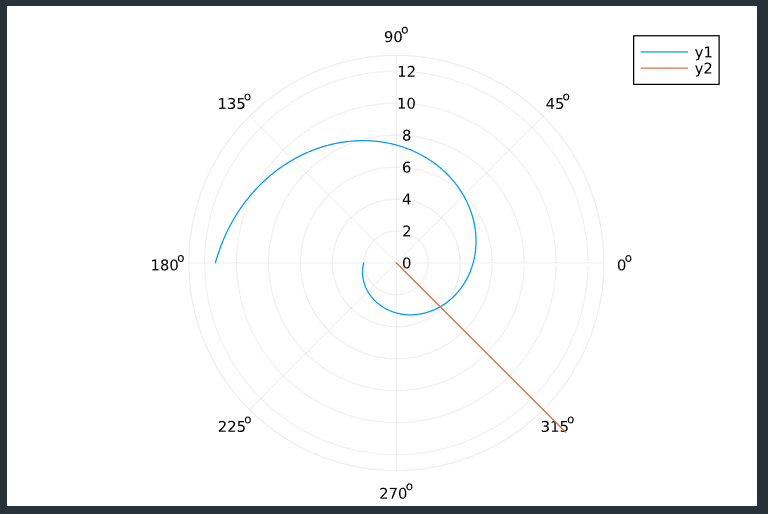

---
## Front matter
title: "Лабораторная работа №2"
subtitle: "Задача о погоне"
author: "Сунгурова Мариян Мухсиновна"

## Generic otions
lang: ru-RU
toc-title: "Содержание"

## Bibliography
bibliography: bib/cite.bib
csl: pandoc/csl/gost-r-7-0-5-2008-numeric.csl

## Pdf output format
toc: true # Table of contents
toc-depth: 2
lof: true # List of figures
lot: true # List of tables
fontsize: 12pt
linestretch: 1.5
papersize: a4
documentclass: scrreprt
## I18n polyglossia
polyglossia-lang:
  name: russian
  options:
	- spelling=modern
	- babelshorthands=true
polyglossia-otherlangs:
  name: english
## I18n babel
babel-lang: russian
babel-otherlangs: english
## Fonts
mainfont: PT Serif
romanfont: PT Serif
sansfont: PT Sans
monofont: PT Mono
mainfontoptions: Ligatures=TeX
romanfontoptions: Ligatures=TeX
sansfontoptions: Ligatures=TeX,Scale=MatchLowercase
monofontoptions: Scale=MatchLowercase,Scale=0.9
## Biblatex
biblatex: true
biblio-style: "gost-numeric"
biblatexoptions:
  - parentracker=true
  - backend=biber
  - hyperref=auto
  - language=auto
  - autolang=other*
  - citestyle=gost-numeric
## Pandoc-crossref LaTeX customization
figureTitle: "Рис."
tableTitle: "Таблица"
listingTitle: "Листинг"
lofTitle: "Список иллюстраций"
lotTitle: "Список таблиц"
lolTitle: "Листинги"
## Misc options
indent: true
header-includes:
  - \usepackage{indentfirst}
  - \usepackage{float} # keep figures where there are in the text
  - \floatplacement{figure}{H} # keep figures where there are in the text
---

# Цель работы

Построить математическую модель для выбора правильной стратегии при решении примера задачи поиска на примере решения задачи о погоне.

# Задание

**Вариант 23**

На море в тумане катер береговой охраны преследует лодку браконьеров. Через определенный промежуток времени туман рассеивается, и лодка обнаруживается на расстоянии 9,8 км от катера. Затем лодка снова скрывается в тумане и уходит прямолинейно в неизвестном направлении. Известно, что скорость катера в 3,8 раза больше скорости браконьерской лодки.

1. Запишите уравнение, описывающее движение катера, с начальными условиями для двух случаев (в зависимости от расположения катера относительно лодки в начальный момент времени).
2. Постройте траекторию движения катера и лодки для двух случаев.
3. Найдите точку пересечения траектории катера и лодки

# Теоретическое введение

**Кривая погони** — кривая, представляющая собой решение задачи о «погоне», которая ставится следующим образом. Пусть точка M равномерно движется по некоторой заданной кривой. Требуется найти траекторию равномерного движения точки N такую, что касательная, проведённая к траектории в любой момент движения, проходила бы через соответствующее этому моменту положение точки M.

# Выполнение лабораторной работы
Примем за t0=0 , xл0 = 0 - место нахождения лодки браконьеров в
момент обнаружения, xk0 - место нахождения катера береговой охраны
относительно лодки браконьеров в момент обнаружения лодки.

Введем полярные координаты. Считаем, что полюс - это точка обнаружения
лодки браконьеров xлх, а полярная ось $r$ проходит через точку
нахождения катера береговой охраны.

Чтобы найти расстояниеx (расстояние после которого катер начнет
двигаться вокруг полюса), необходимо составить простое уравнение. Пусть
через время $t$ катер и лодка окажутся на одном расстоянии $x$ от полюса. За
это время лодка пройдет $x$ , а катер $k-x$ (илиk $x-k$ , в зависимости от
начального положения катера относительно полюса). Время, за которое они
пройдут это расстояние, вычисляется как $\dfrac{x}{v}$ или $\dfrac{k-x}{v}$.

Так как время одно и то же, то эти величины одинаковы. Тогда неизвестное расстояние $x$ можно найти из следующего уравнения:
$$\dfrac{x}{v}=\dfrac{k-x}{3.8v}$$ 
$$\dfrac{x}{v}=\dfrac{k+x}{3.8v}$$ 
Отсюда мы найдем два значения
$x$1 = $\dfrac{5k}{24}$, $x$2 = $\dfrac{5k}{14}$, задачу будем решать для двух случаев.
Cкорость катера раскладываем на две составляющие: $v$$r$ - радиальная скорость, $v$$t$ - тангенциальная скорость.Нам нужно, чтобы радиальная скорость была равна скорости лодки, поэтому полагаемd $\dfrac{dr}{dt} = v$

Тангенциальная скорость – это линейная скорость вращения катера
относительно полюса - $v$$t$ = $r\dfrac{d\theta}{dt}$

$$vt = \sqrt{(3.8)^2v^2 - v^2} = \sqrt{13.44}v$$

Тогда получаем $r\dfrac{d\theta}{dt} = \sqrt{13.44}v$

Решение исходной задачи сводится к решению системы из двух
дифференциальных уравнений

$$\begin{cases}
   \dfrac{dr}{dt} = v\\
   r\dfrac{d\theta}{dt} = \sqrt{13.44}v
\end{cases}$$

С начальными условиями:
$$\begin{cases}
   \theta_ 0 = 0\\
  r_0 = x_1
\end{cases}$$
$$\begin{cases}
   \theta_ 0 = -\pi\\
  r_0 = x_2
\end{cases}$$

Рассмотрим начальные условия:
$$\begin{cases}
   \theta_ 0 = 0\\
  r_0 = x_1
\end{cases}$$

Построим траекторию движения катера и лодки для данного случая. Ниже приведен код на языке Julia:

<!-- (рис. [-@fig:001]). -->

{#fig:001 width=70%}
{#fig:002 width=70%}
**В результатае был получен следующий график движения катера**
{#fig:003 width=70%}

Для второго случая:
$$\begin{cases}
   \theta_ 0 = -\pi\\
  r_0 = x_2
\end{cases}$$

{#fig:004 width=70%}
**В результатае был получен следующий график движения катера**
{#fig:005 width=70%}

**Рассмотрим движение лодки**

{#fig:006 width=70%}

**В результатае был получен следующий график движения катера и лодки для первого начального условия**
{#fig:007 width=70%}

**В результатае был получен следующий график движения катера и лодки для второго начального условия**
{#fig:008 width=70%}

# Выводы

Построена математическая модель для выбора правильной стратегии при решении примера задачи поиска на примере решения задачи о погоне.

# Список литературы{.unnumbered}

::: {#refs}
:::
