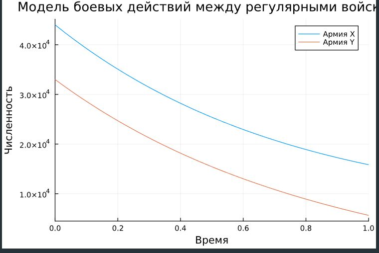
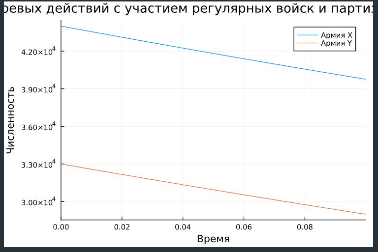
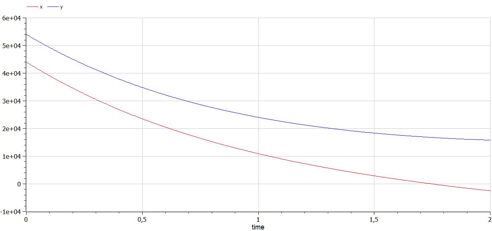
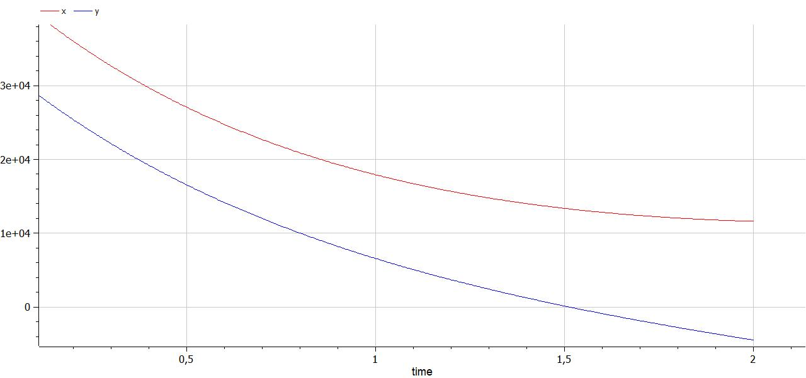

---
## Front matter
lang: ru-RU
title: Лабораторная работа №3
subtitle: Модель боевых действий
author:
  - Сунгурова М. М.
institute:
  - Российский университет дружбы народов, Москва, Россия
date: 24 февраля 2024

## i18n babel
babel-lang: russian
babel-otherlangs: english

## Formatting pdf
toc: false
toc-title: Содержание
slide_level: 2
aspectratio: 169
section-titles: true
theme: metropolis
header-includes:
 - \metroset{progressbar=frametitle,sectionpage=progressbar,numbering=fraction}
 - '\makeatletter'
 - '\beamer@ignorenonframefalse'
 - '\makeatother'
---

# Информация

## Докладчик

:::::::::::::: {.columns align=center}
::: {.column width="70%"}

  * Сунгурова Мариян Мухсиновна
  * студентка группы НКНбд-01-21
  * Российский университет дружбы народов

:::
::: {.column width="30%"}


:::
::::::::::::::

# Вводная часть


## Цели и задачи

- Создать модели боевых действий 
- Проанализировать результаты симуляций

## Материалы и методы

- Язык программирования `Julia` и его библиотеки
- `Open Modelica`

# выполнение лабораторной

## Задание

Между страной Х и страной У идет война. Численность состава войск
исчисляется от начала войны, и являются временными функциями $x(t)$ и $y(t)$ . В
начальный момент времени страна Х имеет армию численностью 44 000 человек, а
в распоряжении страны У армия численностью в 33 000 человек. Для упрощения
модели считаем, что коэффициенты $a, b, c, h$ постоянны. Также считаем $P(t)$ и $Q(t)$  непрерывные функции.
Постройте графики изменения численности войск армии Х и армии У для следующих случаев:
- Модель боевых действий между регулярными войсками
- Модель ведение боевых действий с участием регулярных войск и партизанских отрядов

## Построение численного решения при помощи языка программирования Julia 

- **Рассмотрим случай двух регулярных армий**
- Коэффициент смертности, не связанный с боевыми действиями у первой армии 0,55, у второй 0,8. Коэффициенты эффективности первой и второй армии 0,8 и 0,35 соответственно.
- Функция, описывающая подход подкрепление первой армии, $P(t) = \sin{t}+1$, подкрепление второй армии описывается функцией $Q(t) = \cos{2t}$. 


## Построение численного решения при помощи языка программирования Julia 

Тогда получим следующую систему, описывающую противостояние между регулярными войсками X и Y:

$$
\begin{cases}
\dfrac{dx}{dt} = -0,55 x(t)- 0,8y(t) + \sin{t}+1\\
\dfrac{dy}{dt} = -0,8 x(t)- 0,35 y(t) + \cos{2t}
\end{cases}
$$

## Построение численного решения при помощи языка программирования Julia 

Зададим начальные условия:

$$
\begin{cases}
x_0 = 44000 \\
y_0 = 33000
\end{cases}
$$

## Построение численного решения при помощи языка программирования Julia 

В Julia начальные условия задаются следующим образом:
```julia
x0 = 44000
y0 = 33000
p1 = [0.55, 0.8, 0.8, 0.35 ]
tspan = (0, 1)
```

## Построение численного решения при помощи языка программирования Julia 

Система ОДУ и соответстыующая задача Коши, заданные при помощи функции
```julia
function f1(u, p, t)
    x, y = u
    a, b, c, h = p
    dx = -a*x-b*y + sin(t) + 1
    dy = -c*x - h*y + cos(2*t)
    return [dx, dy]
end

prob_1 = ODEProblem(f1, [x0, y0], tspan, p1)
```


## Построение численного решения при помощи языка программирования Julia 

Решение при помощи функции solve:
``` julia
sol_1 = solve(prob_1, Tsit5())

```


## Построение численного решения при помощи языка программирования Julia 

- Построение соответствующего графика(рис. [-@fig:001]).

- plot(sol_1, title="Модель боевых действий между регулярными войсками", label = ["Армия X" "Армия Y"], xaxis = "Время", yaxis="Численность")

{#fig:001 width=50%}

## Построение численного решения при помощи языка программирования Julia 

**Рассмотрим боевые действия с участием регулярной армии и партизанских отрядов**
Рассмотрим следующую систему:

$$
\begin{cases}
\dfrac{dx}{dt} = -0,43 x(t)- 0,79y(t) + \sin{2t}+1\\
\dfrac{dy}{dt} = -0,79 x(t)- 0,23 y(t) + \cos{2t}
\end{cases}
$$


## Построение численного решения при помощи языка программирования Julia 

Зададим начальные условия:

$$
\begin{cases}
x_0 = 44000 \\
y_0 = 33000
\end{cases}
$$

## Построение численного решения при помощи языка программирования Julia 

В Julia начальные условия задаются следующим образом:
```julia
x0 = 44000
y0 = 33000
p2 = [0.43, 0.79, 0.79, 0.23 ]
tspan = (0, 0.1)
```

## Построение численного решения при помощи языка программирования Julia 

Система ОДУ и соответстыующая задача Коши, заданные при помощи функции
```julia
function f2(u, p, t)
    x, y = u
    a, b, c, h = p
    dx = -a*x - b*y + sin(2*t) + 1
    dy = -c*x - h*y + cos(2*t)
    return [dx, dy]
end

prob_2 = ODEProblem(f2, [x0, y0], tspan, p2)

```

## Построение численного решения при помощи языка программирования Julia 
Решение при помощи функции solve:
``` julia
sol_2 = solve(prob_2, Tsit5())
```

## Построение численного решения при помощи языка программирования Julia 
Построение соответствующего графика(рис. [-@fig:002]).

plot(sol_2, title="Модель боевых действий с участием регулярных войск и партизанских отрядов ", label = ["Армия X" "Армия Y"], xaxis = "Время", yaxis="Численность")


{#fig:002 width=50%}

## Построение численного решения при помощи OpenModelica

Реализуем те же модели при помощи OpenModelica. 

**Для случая регулярных армий код будет выглядеть следующим образом:**

## Построение численного решения при помощи OpenModelica

```
model lab3
    Real x(start=44000);
    Real y(start=33000);
    Real p;
    Real q;

    parameter Real a=0.55;
    parameter Real b=0.8;
    parameter Real c=0.8;
    parameter Real h=0.35;

    equation
        der(x) = -a*x-b*y + p;
        der(y) = -c*x -h*y +q;
        p = sin(time)+1;
        q = cos(2*time);

end lab3;
```
## Построение численного решения при помощи OpenModelica

График, построенный в результате симуляции модели lab3(рис. [-@fig:003]).

{#fig:003 width=50%}

## Построение численного решения при помощи OpenModelica

```
model lab3_
    Real x(start=44000);
    Real y(start=33000);
    Real p;
    Real q;

    parameter Real a=0.43;
    parameter Real b=0.79;
    parameter Real c=0.79;
    parameter Real h=0.23;

    equation
        der(x) = -a*x-b*y + p;
        der(y) = -c*x -h*y +q;
        p = sin(2*time)+1;
        q = cos(2*time);

end lab3_;
```
## Построение численного решения при помощи OpenModelica

График для модели lab3_(рис. [-@fig:004]).

{#fig:004 width=50%}


## Результаты

В результате выполнения данной лабораторной работы были созданы и проанализированы модели боевых действий(для двух случаев: с партизанским отрядом и без), а также построены графики по результатам их симуляций. В процессе были также получены навыки использования я.п. Julia и OpenModelica.


# Список литературы

1. Корепанов В.О., Чхартишвили А.Г., Шумов В.В. Базовые модели боевых действий. 


