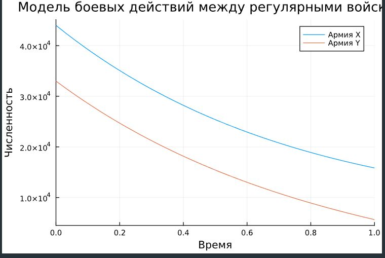
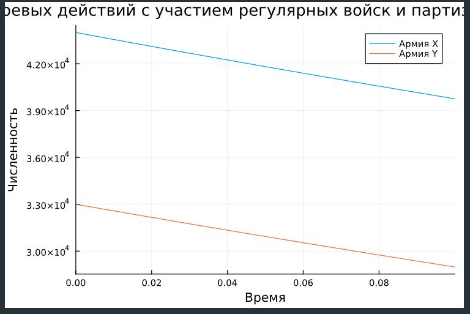
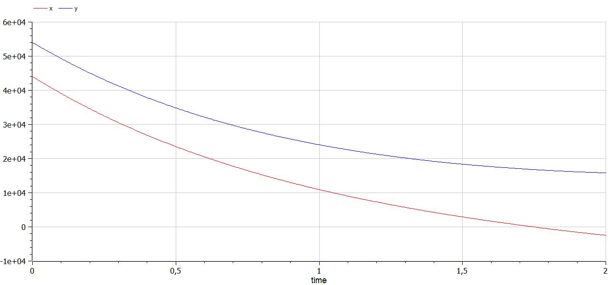
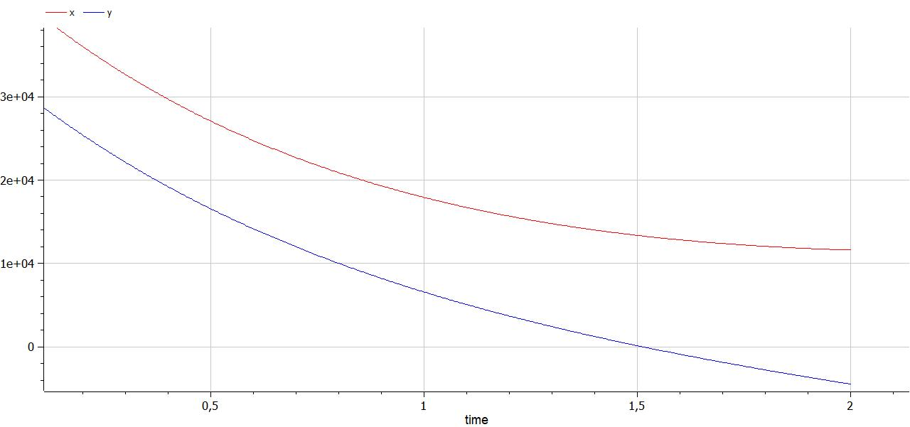

---
## Front matter
title: "Лабораторная работа №3"
subtitle: "Модель боевых действий"
author: "Сунгурова Мариян Мухсиновна"

## Generic otions
lang: ru-RU
toc-title: "Содержание"

## Bibliography
bibliography: bib/cite.bib
csl: pandoc/csl/gost-r-7-0-5-2008-numeric.csl

## Pdf output format
toc: true # Table of contents
toc-depth: 2
lof: true # List of figures
lot: true # List of tables
fontsize: 12pt
linestretch: 1.5
papersize: a4
documentclass: scrreprt
## I18n polyglossia
polyglossia-lang:
  name: russian
  options:
	- spelling=modern
	- babelshorthands=true
polyglossia-otherlangs:
  name: english
## I18n babel
babel-lang: russian
babel-otherlangs: english
## Fonts
mainfont: PT Serif
romanfont: PT Serif
sansfont: PT Sans
monofont: PT Mono
mainfontoptions: Ligatures=TeX
romanfontoptions: Ligatures=TeX
sansfontoptions: Ligatures=TeX,Scale=MatchLowercase
monofontoptions: Scale=MatchLowercase,Scale=0.9
## Biblatex
biblatex: true
biblio-style: "gost-numeric"
biblatexoptions:
  - parentracker=true
  - backend=biber
  - hyperref=auto
  - language=auto
  - autolang=other*
  - citestyle=gost-numeric
## Pandoc-crossref LaTeX customization
figureTitle: "Рис."
tableTitle: "Таблица"
listingTitle: "Листинг"
lofTitle: "Список иллюстраций"
lotTitle: "Список таблиц"
lolTitle: "Листинги"
## Misc options
indent: true
header-includes:
  - \usepackage{indentfirst}
  - \usepackage{float} # keep figures where there are in the text
  - \floatplacement{figure}{H} # keep figures where there are in the text
---

# Цель работы

Построить и проанализировать модель боевых действий, используя Julia и OpenModelica

# Задание

Между страной Х и страной У идет война. Численность состава войск
исчисляется от начала войны, и являются временными функциями $x(t)$ и $y(t)$ . В
начальный момент времени страна Х имеет армию численностью 44 000 человек, а
в распоряжении страны У армия численностью в 33 000 человек. Для упрощения
модели считаем, что коэффициенты $a, b, c, h$ постоянны. Также считаем $P(t)$ и $Q(t)$  непрерывные функции.
Постройте графики изменения численности войск армии Х и армии У для следующих случаев:
1. Модель боевых действий между регулярными войсками
2. Модель ведение боевых действий с участием регулярных войск и партизанских отрядов
   
# Теоретическое введение

Моделирование боевых и военных действий является важнейшей научной и практической задачей, направленной на предоставление командованию количественных оснований для принятия решений. Первые модели боя были разработаны в годы первой мировой войны, а в настоящее время они получили широкое распространение в связи с массовым внедрением средств автоматизации.
Большой вклад в развитие моделей боя внесен специалистами Вычислительного центра им. А. А. Дородницына. В частности, П. С. Краснощеков и А. А. Петров описали динамику боя в пространстве, представив модель перемещения линии фронта. Ю. Н. Павловским предложен способ учета морального фактора в уравнении равенства сил квадратичной модели боя. 

Уравнения Осипова – Ланчестера можно записать в виде:

$$
\begin{cases}
 \dfrac{dx}{dt} = -a_{y}*y^p*x^q \\
 \dfrac{dy}{dt} = -a_{x}*x^p*y^q
\end{cases}
$$

где $x(y)$ – численности войск первой (второй) стороны в момент времени $t$; $a_x$ ($a_y$) – эффективность огня первой (второй) стороны (число поражаемых целей противника в единицу времени)1; p и q – параметры степени.

# Выполнение лабораторной работы

## Построение численного решения при помощи языка программирования Julia 

**Рассмотрим случай двух регулярных армий**

Коэффициент смертности, не связанный с боевыми действиями у первой армии 0,55, у второй 0,8. Коэффициенты эффективности первой и второй армии 0,8 и 0,35 соответственно. 

Функция, описывающая подход подкрепление первой армии, $P(t) = \sin{t}+1$, подкрепление второй армии описывается функцией $Q(t) = \cos{2t}$. 

Тогда получим следующую систему, описывающую противостояние между регулярными войсками X и Y:

$$
\begin{cases}
\dfrac{dx}{dt} = -0,55 x(t)- 0,8y(t) + \sin{t}+1\\
\dfrac{dy}{dt} = -0,8 x(t)- 0,35 y(t) + \cos{2t}
\end{cases}
$$

Зададим начальные условия:

$$
\begin{cases}
x_0 = 44000 \\
y_0 = 33000
\end{cases}
$$

В Julia начальные условия задаются следующим образом:
```julia
x0 = 44000
y0 = 33000
p1 = [0.55, 0.8, 0.8, 0.35 ]
tspan = (0, 1)
```
Система ОДУ и соответстыующая задача Коши, заданные при помощи функции
```julia
function f1(u, p, t)
    x, y = u
    a, b, c, h = p
    dx = -a*x-b*y + sin(t) + 1
    dy = -c*x - h*y + cos(2*t)
    return [dx, dy]
end

prob_1 = ODEProblem(f1, [x0, y0], tspan, p1)
```
Решение при помощи функции solve:
``` julia
sol_1 = solve(prob_1, Tsit5())
```
Построение соответствующего графика(рис. [-@fig:001]).

plot(sol_1, title="Модель боевых действий между регулярными войсками", label = ["Армия X" "Армия Y"], xaxis = "Время", yaxis="Численность")

{#fig:001 width=70%}


**Рассмотрим боевые действия с участием регулярной армии и партизанских отрядов**

Рассмотрим следующую систему:

$$
\begin{cases}
\dfrac{dx}{dt} = -0,43 x(t)- 0,79y(t) + \sin{2t}+1\\
\dfrac{dy}{dt} = -0,79 x(t)- 0,23 y(t) + \cos{2t}
\end{cases}
$$

Зададим начальные условия:

$$
\begin{cases}
x_0 = 44000 \\
y_0 = 33000
\end{cases}
$$

В Julia начальные условия задаются следующим образом:
```julia
x0 = 44000
y0 = 33000
p2 = [0.43, 0.79, 0.79, 0.23 ]
tspan = (0, 0.1)
```
Система ОДУ и соответстыующая задача Коши, заданные при помощи функции
```julia
function f2(u, p, t)
    x, y = u
    a, b, c, h = p
    dx = -a*x - b*y + sin(2*t) + 1
    dy = -c*x - h*y + cos(2*t)
    return [dx, dy]
end

prob_2 = ODEProblem(f2, [x0, y0], tspan, p2)

```
Решение при помощи функции solve:
``` julia
sol_2 = solve(prob_2, Tsit5())
```
Построение соответствующего графика(рис. [-@fig:002]).

plot(sol_2, title="Модель боевых действий с участием регулярных войск и партизанских отрядов ", label = ["Армия X" "Армия Y"], xaxis = "Время", yaxis="Численность")


{#fig:002 width=70%}

## Построение численного решения при помощи OpenModelica

Реализуем те же модели при помощи OpenModelica. 

**Для случая регулярных армий код будет выглядеть следующим образом:**
```
model lab3
    Real x(start=44000);
    Real y(start=33000);
    Real p;
    Real q;

    parameter Real a=0.55;
    parameter Real b=0.8;
    parameter Real c=0.8;
    parameter Real h=0.35;

    equation
        der(x) = -a*x-b*y + p;
        der(y) = -c*x -h*y +q;
        p = sin(time)+1;
        q = cos(2*time);

end lab3;
```
График, построенный в результате симуляции модели lab3(рис. [-@fig:003]).

{#fig:003 width=70%}

**Для случая регулярных армий и партизанских отрядов**

```
model lab3_
    Real x(start=44000);
    Real y(start=33000);
    Real p;
    Real q;

    parameter Real a=0.43;
    parameter Real b=0.79;
    parameter Real c=0.79;
    parameter Real h=0.23;

    equation
        der(x) = -a*x-b*y + p;
        der(y) = -c*x -h*y +q;
        p = sin(2*time)+1;
        q = cos(2*time);

end lab3_;
```

График для модели lab3_(рис. [-@fig:004]).

{#fig:004 width=70%}

# Выводы

В результате выполнения данной лабораторной работы были созданы и проанализированы модели боевых действий(для двух случаев: с партизанским отрядом и без), а также построены графики по результатам их симуляций. В процессе были также получены навыки использования я.п. Julia и OpenModelica.

# Список литературы{.unnumbered}

::: {#refs}
:::
