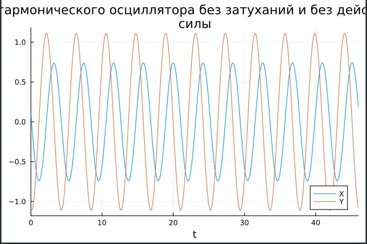
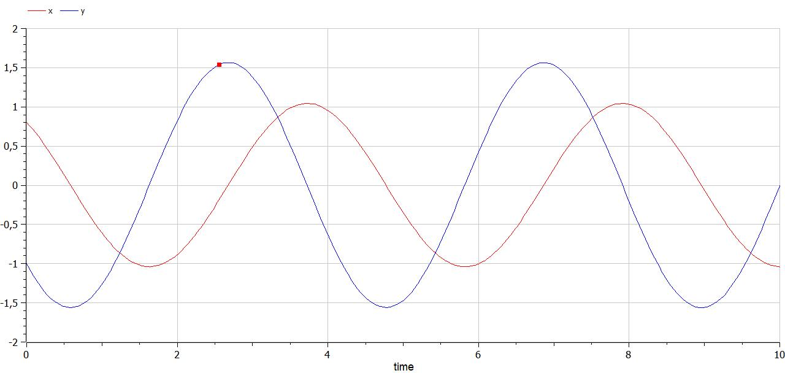
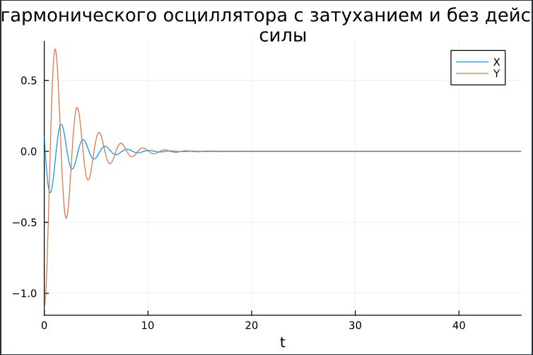
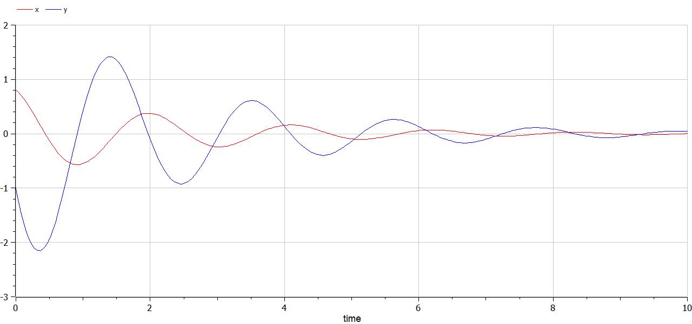
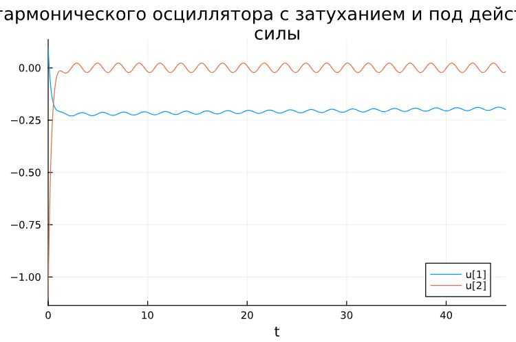
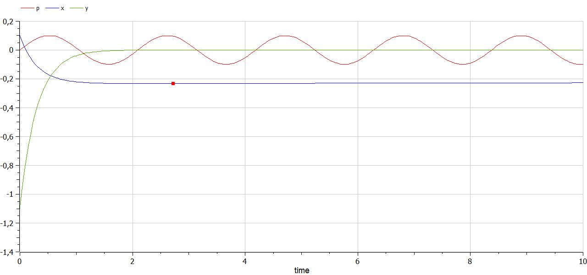

---
## Front matter
lang: ru-RU
title: Лабораторная работа №4
subtitle: Модель гармонических колебаний
author:
  - Сунгурова Мариян Мухсиновна
institute:
  - Российский университет дружбы народов, Москва, Россия
date: 02 марта 2024

## i18n babel
babel-lang: russian
babel-otherlangs: english

## Formatting pdf
toc: false
toc-title: Содержание
slide_level: 2
aspectratio: 169
section-titles: true
theme: metropolis
header-includes:
 - \metroset{progressbar=frametitle,sectionpage=progressbar,numbering=fraction}
 - '\makeatletter'
 - '\beamer@ignorenonframefalse'
 - '\makeatother'
---

# Информация

## Докладчик

:::::::::::::: {.columns align=center}
::: {.column width="70%"}

  * Сунгурова Мариян Мухсиновна
  * студентка группы НКНбд-01-21
  * Российский университет дружбы народов

:::
::: {.column width="30%"}

:::
::::::::::::::

# Вводная часть

## Цели 

Исследовать математическую модель гармонического осциллятора.

## Задание
Постройте фазовый портрет гармонического осциллятора и решение уравнения гармонического осциллятора для следующих случаев

## Задачи

1. Колебания гармонического осциллятора без затуханий и без действий внешней силы $\ddot x + 1.5x = 0$
2. Колебания гармонического осциллятора c затуханием и без действий внешней силы $\ddot x + 0.8\dot x + 3x = 0$
3. Колебания гармонического осциллятора c затуханием и под действием внешней силы $\ddot x + 3.3\dot x + 0.1x = 0.1sin(3t)$

На интервале $t \in [0; 46]$ (шаг 0.05) с начальными условиями $x_0 = 0.1, \, y_0=-1.1$


## Материалы и методы

- Язык программирования `Julia` 
- Библиотеки
	- `OrdinaryDiffEq`
	- `Plots`

# Выполнение лабораторной работы

## Теоретическое введение

Гармонические колебания выделяются из всех остальных видов колебаний по следующим причинам:
- Очень часто малые колебания, как свободные, так и вынужденные, которые происходят в реальных системах, можно считать имеющими форму гармонических колебаний или очень близкую к ней.
- Как установил в 1822 году Фурье, широкий класс периодических функций может быть разложен на сумму тригонометрических компонентов — в ряд Фурье. Другими словами, любое периодическое колебание может быть представлено как сумма гармонических колебаний с соответствующими амплитудами, частотами и начальными фазами. 
- Для широкого класса систем откликом на гармоническое воздействие является гармоническое колебание (свойство линейности), при этом связь воздействия и отклика является устойчивой характеристикой системы. С учётом предыдущего свойства это позволяет исследовать прохождение колебаний произвольной формы через системы.


## Реализация модели гормонического осциллятора на языке программирования Julia.

Запишем функцию для решения модели линейного гормонического осциллятора. 

Интервал $t \in [0; 46]$ (шаг 0.05) с начальными условиями $x_0 = 0.1, \, y_0=-1.1$ . В Julia:

```julia

//Начальные условия и параметры

tspan = (0, 46)
p1 = [0, 1.5]
p2 = [0.8, 3]
p3 =  [3.3, 0.1]

du0 = [-1.1]
du = [0.1]
```

## Реализация модели гормонического осциллятора на языке программирования Julia.
```julia
//без действий внешний силы

function harm_osc(du,u,p,t)
	g,w = p
	du[1] = u[2]
	du[2] = -w^2 .* u[1] - g.*u[2]
end
```

## Реализация модели гормонического осциллятора на языке программирования Julia.
```julia
//внешняя сила
f(t) = 0.1sin(3*t)

//с действием в нешней силы
function forced_harm_osc(du,u,p,t)
	g,w = p
	du[1] = u[2]
	du[2] = -w^2 .* u[1] - g.*u[2] .+f(t)
end
```

## Реализация модели гормонического осциллятора на языке программирования Julia.

Для задания воспользуемся функцией `SecondOrderODEProblem`:

```julia

problem1 = ODEProblem(harm_osc, [0.8, -1], tspan, p1)
solution1 = solve(problem1, Tsit5(),saveat=0.05)
problem2 = ODEProblem(harm_osc, [0.8, -1], tspan, p2)
solution2 = solve(problem2, Tsit5(),saveat=0.05)
problem3 = ODEProblem(forced_harm_osc, [0.8, -1], tspan, p3)
solution3 = solve(problem3, Tsit5(),saveat=0.05)
```

## Реализация модели гормонического осциллятора при помощи OpenModelica
Модель для колебания без затухания и без действия внешних сил:

```
model lab4

Real x(start=0.8);
Real y(start=-1);

parameter Real w=1.5;
parameter Real g=0;

equation
der(x) = y;
der(y) = -w^2*x-g*y;

end lab4;
```
## Реализация модели гормонического осциллятора при помощи OpenModelica
Модель для колебания с затуханием и без действия внешних сил:

```
model lab4_

Real x(start=0.8);
Real y(start=-1);

parameter Real w=3.0;
parameter Real g=0.8;

equation
der(x) = y;
der(y) = -w^2*x-g*y;

end lab4_;
```

## Реализация модели гормонического осциллятора при помощи OpenModelica

Модель для колебания с затуханием и действием внешних сил:

```
model lab4

Real x(start=0.1);
Real y(start=-1.1);
parameter Real w=0.1;
parameter Real g=3.3;

Real p;

equation
der(x) = y;
der(y) = -w^2*x-g*y;
p=0.1*sin(3*time);

end lab4;
```

##  Сравнение графиков

Графики решений, полученные с помощью OpenModelica и Julia идентичны(рис. @fig:002,  @fig:003)

## Колебания гармонического осциллятора без затуханий и без действий внешней силы. Julia

{#fig:002 width=60%}

## Колебания гармонического осциллятора без затуханий и без действий внешней силы. OpenModelica

{#fig:003 width=60%}

##  Сравнение графиков
Можно видеть, что колебание осциллятора периодично, график не задухает.


## Колебания гармонического осциллятора c затуханием и без действий внешней силы 


Графики, полученные с помощью OpenModelica и Julia идентичны(рис. @fig:004,  @fig:005):

## Колебания гармонического осциллятора с затуханем и без действий внешней силы. Julia

{#fig:006 width=70%}

## Колебания гармонического осциллятора с затуханим и без действий внешней силы. OpenModelica

{#fig:007 width=70%}

##  Сравнение графиков

Можно видеть, что снчала происходят колебания осциллятора, а затем график затухает.


## Колебания гармонического осциллятора c затуханием и под действием внешней силы 

Графики, полученные с помощью OpenModelica и Julia идентичны(рис. @fig:010,  @fig:0011):

## Колебания гармонического осциллятора c затуханием и под действием внешней силы. Julia

{#fig:010 width=70%}

## Колебания гармонического осциллятора с затуханием и под действий внешней силы. OpenModelica

{#fig:011 width=70%}

##  Сравнение графиков

Можно увидеть, что система приходит в состояние равновесия, период колебаний больше, чем в первом случае, так как затухание замедляет его.


# Выводы

Построили математическую модель гармонического осциллятора и провели анализ.

# Список литературы

1. Harmonic oscillator [Электронный ресурс]. Wikimedia Foundation, Inc., 2024. URL: https://en.wikipedia.org/wiki/Harmonic_oscillator.