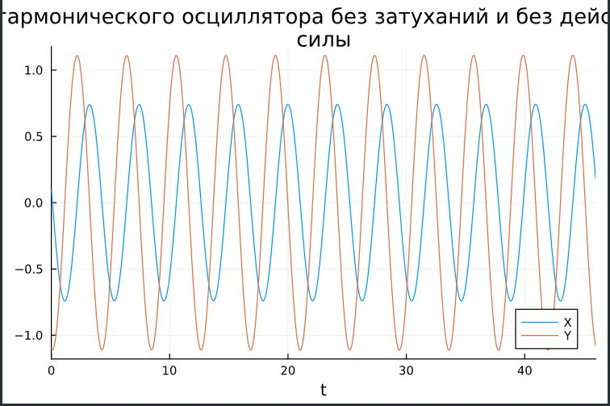
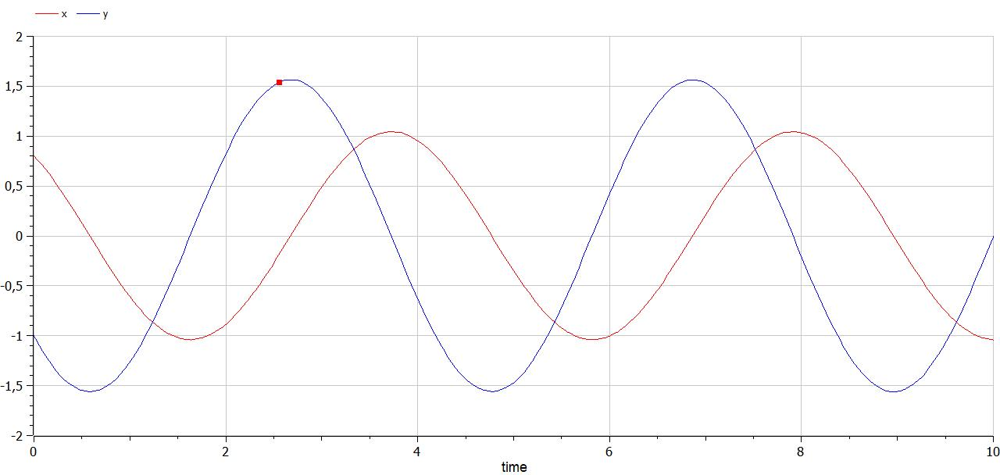
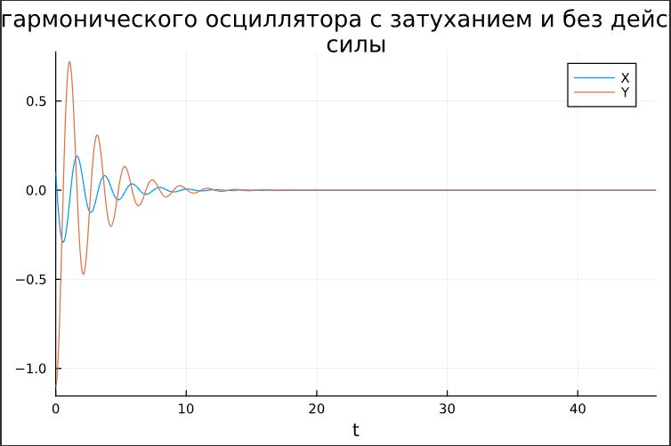
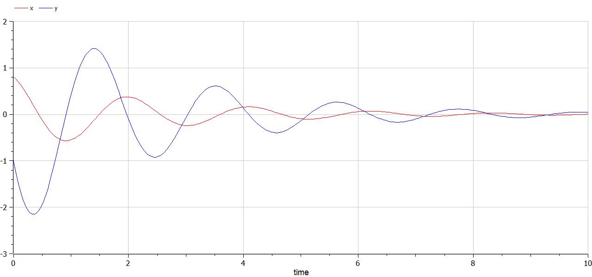
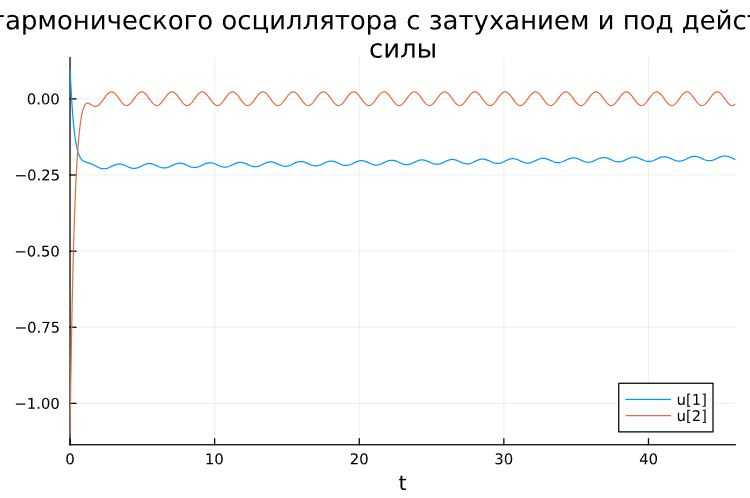
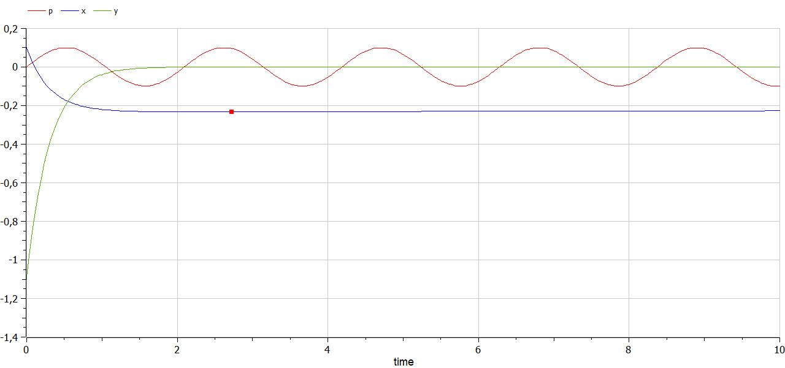

---
## Front matter
title: "Лабораторная работа №4"
subtitle: "Модель гармонических колебаний"
author: "Cунгурова Мариян Мухсиновна"

## Generic otions
lang: ru-RU
toc-title: "Содержание"

## Bibliography
bibliography: bib/cite.bib
csl: pandoc/csl/gost-r-7-0-5-2008-numeric.csl

## Pdf output format
toc: true # Table of contents
toc-depth: 2
lof: true # List of figures
lot: false # List of tables
fontsize: 12pt
linestretch: 1.5
papersize: a4
documentclass: scrreprt
## I18n polyglossia
polyglossia-lang:
  name: russian
  options:
	- spelling=modern
	- babelshorthands=true
polyglossia-otherlangs:
  name: english
## I18n babel
babel-lang: russian
babel-otherlangs: english
## Fonts
mainfont: PT Serif
romanfont: PT Serif
sansfont: PT Sans
monofont: PT Mono
mainfontoptions: Ligatures=TeX
romanfontoptions: Ligatures=TeX
sansfontoptions: Ligatures=TeX,Scale=MatchLowercase
monofontoptions: Scale=MatchLowercase,Scale=0.9
## Biblatex
biblatex: true
biblio-style: "gost-numeric"
biblatexoptions:
  - parentracker=true
  - backend=biber
  - hyperref=auto
  - language=auto
  - autolang=other*
  - citestyle=gost-numeric
## Pandoc-crossref LaTeX customization
figureTitle: "Рис."
tableTitle: "Таблица"
listingTitle: "Листинг"
lofTitle: "Список иллюстраций"
lotTitle: "Список таблиц"
lolTitle: "Листинги"
## Misc options
indent: true
header-includes:
  - \usepackage{indentfirst}
  - \usepackage{float} # keep figures where there are in the text
  - \floatplacement{figure}{H} # keep figures where there are in the text
---

# Цель работы

Исследовать математическую модель гармонического осциллятора.

# Задание

Постройте фазовый портрет гармонического осциллятора и решение уравнения гармонического осциллятора для следующих случаев

1. Колебания гармонического осциллятора без затуханий и без действий внешней силы $\ddot x + 1.5x = 0$
2. Колебания гармонического осциллятора c затуханием и без действий внешней силы $\ddot x + 0.8\dot x + 3x = 0$
3. Колебания гармонического осциллятора c затуханием и под действием внешней силы $\ddot x + 3.3\dot x + 0.1x = 0.1sin(3t)$

На интервале $t \in [0; 46]$ (шаг 0.05) с начальными условиями $x_0 = 0.1, \, y_0=-1.1$ 

# Теоретическое введение

Гармонические колебания выделяются из всех остальных видов колебаний по следующим причинам:
- Очень часто малые колебания, как свободные, так и вынужденные, которые происходят в реальных системах, можно считать имеющими форму гармонических колебаний или очень близкую к ней.
- Как установил в 1822 году Фурье, широкий класс периодических функций может быть разложен на сумму тригонометрических компонентов — в ряд Фурье. Другими словами, любое периодическое колебание может быть представлено как сумма гармонических колебаний с соответствующими амплитудами, частотами и начальными фазами. Среди слагаемых этой суммы существует гармоническое колебание с наименьшей частотой, которая называется основной частотой, а само это колебание — первой гармоникой или основным тоном, частоты же всех остальных слагаемых, гармонических колебаний, кратны основной частоте, и эти колебания называются высшими гармониками или обертонами — первым, вторым и т.д.
- Для широкого класса систем откликом на гармоническое воздействие является гармоническое колебание (свойство линейности), при этом связь воздействия и отклика является устойчивой характеристикой системы. С учётом предыдущего свойства это позволяет исследовать прохождение колебаний произвольной формы через системы.

# Выполнение лабораторной работы

## Программная реализация модели гормонического осциллятора

Запишем функцию для решения модели линейного гормонического осциллятора. 

Интервал $t \in [0; 46]$ (шаг 0.05) с начальными условиями $x_0 = 0.1, \, y_0=-1.1$ . В Julia:

```julia

//Начальные условия и параметры

tspan = (0, 46)
p1 = [0, 1.5]
p2 = [0.8, 3]
p3 =  [3.3, 0.1]

du0 = [-1.1]
du = [0.1]

//без действий внешний силы

function harm_osc(du,u,p,t)
	g,w = p
	du[1] = u[2]
	du[2] = -w^2 .* u[1] - g.*u[2]
end

//внешняя сила
f(t) = 0.1sin(3*t)

//с действием в нешней силы
function forced_harm_osc(du,u,p,t)
	g,w = p
	du[1] = u[2]
	du[2] = -w^2 .* u[1] - g.*u[2] .+f(t)
end
```

Для задания воспользуемся функцией `SecondOrderODEProblem`:

```julia

problem1 = ODEProblem(harm_osc, [0.8, -1], tspan, p1)
solution1 = solve(problem1, Tsit5(),saveat=0.05)
problem2 = ODEProblem(harm_osc, [0.8, -1], tspan, p2)
solution2 = solve(problem2, Tsit5(),saveat=0.05)
problem3 = ODEProblem(forced_harm_osc, [0.8, -1], tspan, p3)
solution3 = solve(problem3, Tsit5(),saveat=0.05)
```

Также зададим эту модель в OpenModelica. Модель для колебания без затухания и без действия внешних сил:

```
model lab4

Real x(start=0.8);
Real y(start=-1);

parameter Real w=1.5;
parameter Real g=0;


equation
der(x) = y;
der(y) = -w^2*x-g*y;

end lab4;
```

Модель для колебания с затуханием и без действия внешних сил:

```
model lab4_

Real x(start=0.8);
Real y(start=-1);

parameter Real w=3.0;
parameter Real g=0.8;

equation
der(x) = y;
der(y) = -w^2*x-g*y;

end lab4_;

```

Модель для колебания с затуханием и действием внешних сил:

```
model lab4

Real x(start=0.1);
Real y(start=-1.1);

parameter Real w=0.1;
parameter Real g=3.3;

Real p;

equation
der(x) = y;
der(y) = -w^2*x-g*y;
p=0.1*sin(3*time);

end lab4;

```


## Колебания гармонического осциллятора c затуханием и без действий внешней силы. Сравнение графиков


Графики решений, полученные с помощью OpenModelica и Julia идентичны(рис. @fig:002,  @fig:003):

{#fig:002 width=70%}

{#fig:003 width=70%}

Можно видеть, что колебание осциллятора периодично, график не задухает.

## Колебания гармонического осциллятора c затуханием и без действий внешней силы 


Графики, полученные с помощью OpenModelica и Julia идентичны(рис. @fig:004,  @fig:005):

{#fig:006 width=70%}

{#fig:007 width=70%}


Можно видеть, что снчала происходят колебания осциллятора, а затем график затухает.

## Колебания гармонического осциллятора c затуханием и под действием внешней силы 


Графики, полученные с помощью OpenModelica и Julia идентичны(рис. @fig:010,  @fig:0011):

{#fig:010 width=70%}

{#fig:011 width=70%}


Можно увидеть, что система приходит в состояние равновесия, период колебаний больше, чем в первом случае, так как затухание замедляет его.

# Выводы

Построили математическую модель гармонического осциллятора и провели анализ.

# Список литературы{.unnumbered}

::: {#refs}
:::