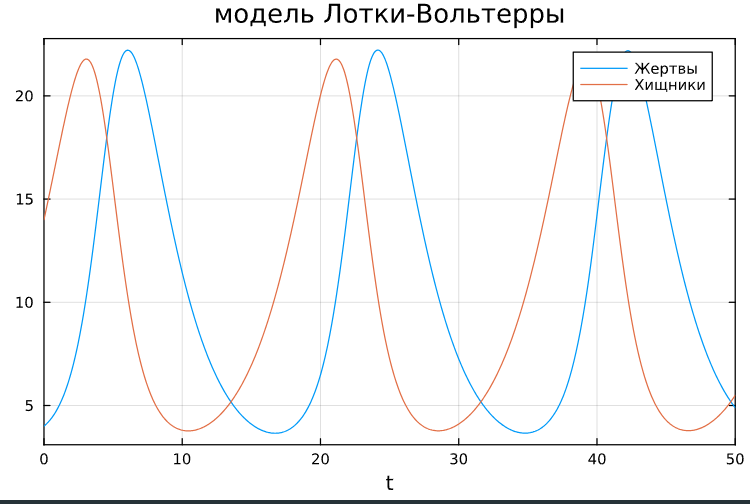
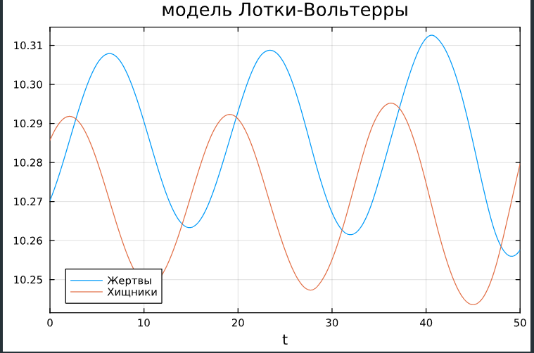

---
## Front matter
lang: ru-RU
title: Лабораторная работа №5
subtitle: Модель хищник-жертва
author:
  -  Сунгурова Мариян Мухсиновна
institute:
  - Российский университет дружбы народов, Москва, Россия
date: 

## i18n babel
babel-lang: russian
babel-otherlangs: english

## Formatting pdf
toc: false
toc-title: Содержание
slide_level: 2
aspectratio: 169
section-titles: true
theme: metropolis
header-includes:
 - \metroset{progressbar=frametitle,sectionpage=progressbar,numbering=fraction}
 - '\makeatletter'
 - '\beamer@ignorenonframefalse'
 - '\makeatother'
---

# Информация

## Докладчик

:::::::::::::: {.columns align=center}
::: {.column width="70%"}

  * Сунгурова М. М.
  * студентка группы НКНбд-01-21
  * Российский университет дружбы народов

:::
::: {.column width="30%"}


:::
::::::::::::::

# Вводная часть

## Цели 

Исследовать математическую модель хищник-жертва.

## Задачи

Для модели «хищник-жертва»:

$$\begin{cases}
\dfrac{dx}{dt} = -0.38 x(t)+0.037 x(t)y(t)\\
\dfrac{dy}{dt} = 0.36y(t)- 0.035 x(t)y(t)
\end{cases}$$

Постройте график зависимости численности хищников от численности жертв, а также графики изменения численности хищников и численности жертв при следующих начальных условиях: $x_0 = 4$, $y_0 = 14$. Найдите стационарное состояние системы.

## Материалы и методы

- Язык программирования `Julia` 
- Библиотеки
	- `OrdinaryDiffEq`
	- `Plots`
- Язык программирования `OpenModelica` 

# Выполнение лабораторной работы

## Теоретическое введение

$$\begin{cases}
  &\dfrac{dx}{dt} = ax(t)-bx(t)y(t)\\
  &\dfrac{dy}{dt} = -cy(t)+dx(t)y(t)
\end{cases}$$

$x$ – число жертв, $y$ - число хищников
$a$, $d$ - коэффициенты прироста популяции, $b$, $c$ - коэффициенты смертностик.

## Теоретическое введение

Система «хищник — жертва» — сложная экосистема, для которой реализованы долговременные отношения между видами хищника и жертвы, типичный пример коэволюции. Отношения между хищниками и их жертвами развиваются циклически, являясь иллюстрацией нейтрального равновесия

##  Julia. Программная реализация модели хищник-жертва

```julia
	function lv(u, p, t)
    a, b, c, d = p 
    x, y = u

    dx = -a*x + b*x*y
    dy = c*y - d*x*y

    return [dx, dy]
end

u0 = [4, 14]
p = [0.38, 0.037, 0.36, 0.035]
tspan = (0.0, 50.0)
prob5 = ODEProblem(lv, u0, tspan, p)
sol5 = solve(prob5, Tsit5())

plot(sol5, title="модель Лотки-Вольтерры", box=:on, label = ["Жертвы" "Хищники"])
```

## Julia. Программная реализация модели хищник-жертва


Для отрисовки стационарного состояния задаём:

```julia
u0 = [0.47/0.048, 0.45/0.046]
```

## Julia. Программная реализация модели хищник-жертва

```julia
u0 = [0.38/0.037, 0.36/0.035]

prob5_ = ODEProblem(lv, u0, tspan, p)
sol5_ = solve(prob5_, Tsit5())
plot(sol5_, title="модель Лотки-Вольтерры", box=:on, label = ["Жертвы" "Хищники"])
```

## OpenModelica. Программная реализация модели хищник-жертва

```
parameter Real a=0.38;
parameter Real b=0.037;
parameter Real c=0.36;
parameter Real d=0.035;

parameter Real x0=4;
parameter Real y0=14;

Real x(start=x0);
Real y(start=y0);

equation

der(x) = -a*x + b*x*y;
der(y) = c*y-d*x*y;
```

## OpenModelica. Программная реализация модели хищник-жертва

Для отрисовки стационарного состояния задаём:

```
parameter Real x0=0.38/0.037;
parameter Real y0=0.36/0.035;
```

## Графики

.jpg){#fig:002 width=70%}


## Графики

{#fig:001 width=70%}

## Графики

{#fig:003 width=70%}{#fig:003 width=70%}


## Графики

.jpg){#fig:004 width=70%}


# Выводы

Построили математическую модель хищник жертва и провели анализ.

# Список литературы

1. Вольтерра В. Математическая теория борьбы за существование. Наука, 1976. 354 с.