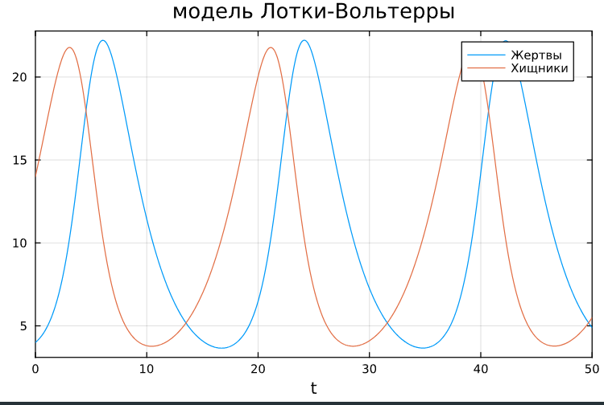
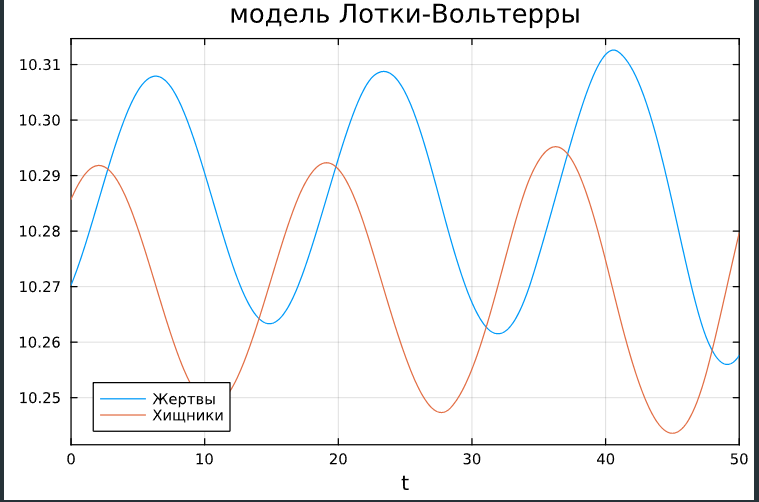

---
## Front matter
title: "Лабораторная работа №5"
subtitle: "Модель хищник-жертва"
author: "Сунгурова Мариян Мухсиновна"

## Generic otions
lang: ru-RU
toc-title: "Содержание"

## Bibliography
bibliography: bib/cite.bib
csl: pandoc/csl/gost-r-7-0-5-2008-numeric.csl

## Pdf output format
toc: true # Table of contents
toc-depth: 2
lof: true # List of figures
lot: false # List of tables
fontsize: 12pt
linestretch: 1.5
papersize: a4
documentclass: scrreprt
## I18n polyglossia
polyglossia-lang:
  name: russian
  options:
	- spelling=modern
	- babelshorthands=true
polyglossia-otherlangs:
  name: english
## I18n babel
babel-lang: russian
babel-otherlangs: english
## Fonts
mainfont: PT Serif
romanfont: PT Serif
sansfont: PT Sans
monofont: PT Mono
mainfontoptions: Ligatures=TeX
romanfontoptions: Ligatures=TeX
sansfontoptions: Ligatures=TeX,Scale=MatchLowercase
monofontoptions: Scale=MatchLowercase,Scale=0.9
## Biblatex
biblatex: true
biblio-style: "gost-numeric"
biblatexoptions:
  - parentracker=true
  - backend=biber
  - hyperref=auto
  - language=auto
  - autolang=other*
  - citestyle=gost-numeric
## Pandoc-crossref LaTeX customization
figureTitle: "Рис."
tableTitle: "Таблица"
listingTitle: "Листинг"
lofTitle: "Список иллюстраций"
lotTitle: "Список таблиц"
lolTitle: "Листинги"
## Misc options
indent: true
header-includes:
  - \usepackage{indentfirst}
  - \usepackage{float} # keep figures where there are in the text
  - \floatplacement{figure}{H} # keep figures where there are in the text
---

# Цель работы

Реализовать и проанализировать математическую модель хищник-жертва.

# Задание

Для модели «хищник-жертва»:

$$\begin{cases}
\dfrac{dx}{dt} = -0.38 x(t)+0.037 x(t)y(t)\\
\dfrac{dy}{dt} = 0.36y(t)- 0.035 x(t)y(t)
\end{cases}$$

Постройте график зависимости численности хищников от численности жертв, а также графики изменения численности хищников и численности жертв при следующих начальных условиях: $x_0 = 4$, $y_0 = 14$. Найдите стационарное состояние системы.

# Теоретическое введение
Система «хищник — жертва» — сложная экосистема, для которой реализованы долговременные отношения между видами хищника и жертвы, типичный пример коэволюции. Отношения между хищниками и их жертвами развиваются циклически, являясь иллюстрацией нейтрального равновесия
Приспособления, вырабатываемые жертвами для противодействия хищникам, способствуют выработке у хищников механизмов преодоления этих приспособлений. Длительное совместное существование хищников и жертв приводит к формированию системы взаимодействия, при которой обе группы устойчиво сохраняются на изучаемой территории. Нарушение такой системы часто приводит к отрицательным экологическим последствиям.

Негативное влияние нарушения коэволюционных связей наблюдается при интродукции видов. В частности, козы и кролики, интродуцированные в Австралии, не имеют на этом материке эффективных механизмов регуляции численности, что приводит к разрушению природных экосистем. 

# Выполнение лабораторной работы

## Поиск стационарного состояния системы

Найдём стационарное состояние системы. Для этого приравняем её правые части к нулю.

$$\begin{cases}
  -0.38 x(t)+0.037 x(t)y(t) = 0\\
  0.36y(t)- 0.0435 x(t)y(t) = 0
\end{cases}$$

Из полученной системы получаем, что стационарное состояние системы будет в точке $x_0 = 0.38/0.037 = 10.2702703$, $y_0 = 0.36/0.035 = 10.2857143$. Если начальные значения задать в стационарном состоянии $x(0) = x_0$, $y(0) = y_0$, то в любой момент времени численность популяций изменяться не будет. При малом отклонении от положения равновесия численности как хищника, так и жертвы с течением времени не возвращаются к равновесным значениям, а совершают периодические колебания вокруг стационарной точки.

## Программная реализация модели хищник-жертва

Зададим функцию для решения модели хищник-жертва. Возьмем интервал $t \in [0; 50]$ (шаг 0.01) с начальными условиями $x_0 = 4, \, y_0=14$.  

```julia
function lv(u, p, t)
    a, b, c, d = p 
    x, y = u

    dx = -a*x + b*x*y
    dy = c*y - d*x*y

    return [dx, dy]
end

u0 = [4, 14]
p = [0.38, 0.037, 0.36, 0.035]
tspan = (0.0, 50.0)
prob5 = ODEProblem(lv, u0, tspan, p)
sol5 = solve(prob5, Tsit5())

plot(sol5, title="модель Лотки-Вольтерры", box=:on, label = ["Жертвы" "Хищники"])
	
```
Для задания проблемы используется функция `ODEProblem`, а для решения -- численный метод `Tsit5()`
Для отрисовки стационарного состояния задаём:

```julia
u0 = [0.38/0.037, 0.36/0.035]

prob5_ = ODEProblem(lv, u0, tspan, p)
sol5_ = solve(prob5_, Tsit5())
plot(sol5_, title="модель Лотки-Вольтерры", box=:on, label = ["Жертвы" "Хищники"])

```
{#fig:001 width=70%}

Также зададим эту модель в OpenModelica. Модель для колебания без затухания и без действия внешних сил:

```
model lab5


parameter Real a=0.38;
parameter Real b=0.037;
parameter Real c=0.36;
parameter Real d=0.035;

parameter Real x0=4;
parameter Real y0=14;

Real x(start=x0);
Real y(start=y0);

equation

der(x) = -a*x + b*x*y;
der(y) = c*y-d*x*y;

end lab5;
```
.jpg){#fig:002 width=70%}

Для отрисовки стационарного состояния меняем значения параметров:

```
parameter Real x0=0.38/0.037;
parameter Real y0=0.36/0.035;
```

## Графики

Графики решений, полученные с помощью OpenModelica и Julia(рис. @fig:003,  @fig:004):

{#fig:003 width=70%}

.jpg){#fig:004 width=70%}


Действительно, если начальное условие соответствует стационарной точке, то система находится в стационарном состоянии, то есть число хищников и жертв не изменяется.

# Выводы

Построили математическую модель хищник жертва и провели анализ.

# Список литературы{.unnumbered}

::: {#refs}
:::