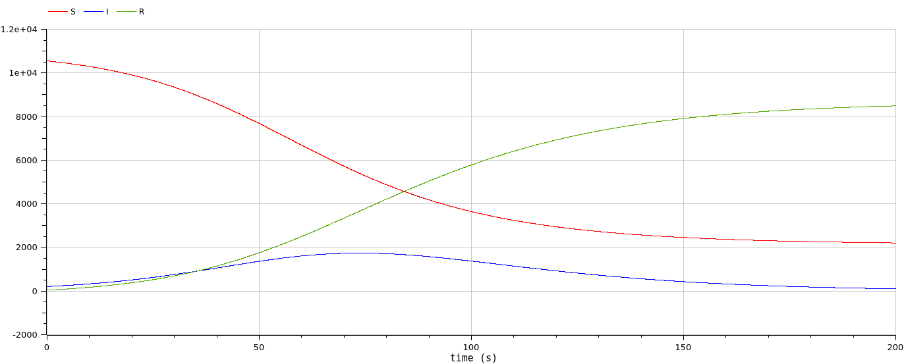
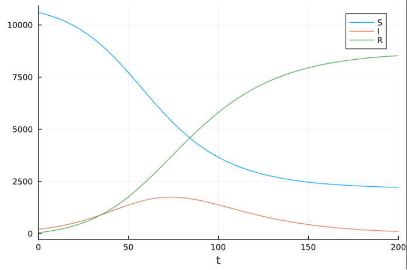
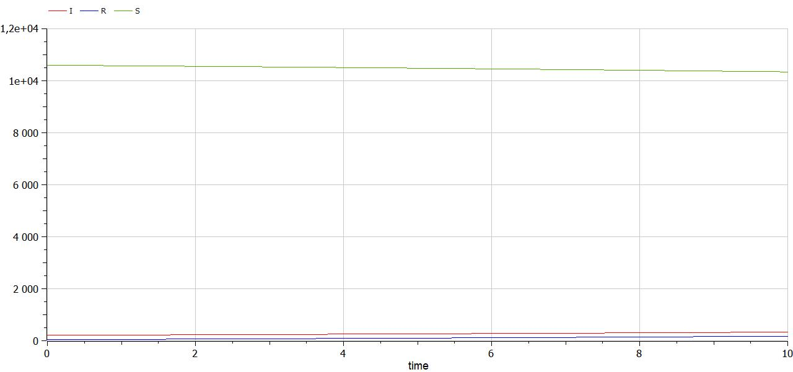
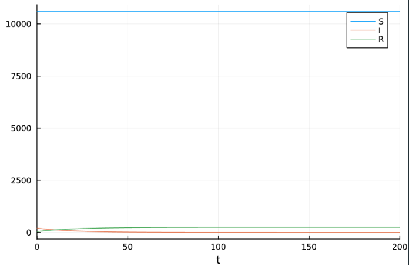

---
## Front matter
lang: ru-RU
title: Лабораторная работа №6
subtitle: Задача об эпидемии
author:
  - Сунгурова Мариян Мухсиновна
institute:
  - Российский университет дружбы народов, Москва, Россия

date: 16 марта 2024

## i18n babel
babel-lang: russian
babel-otherlangs: english

## Formatting pdf
toc: false
toc-title: Содержание
slide_level: 2
aspectratio: 169
section-titles: true
theme: metropolis
header-includes:
 - \metroset{progressbar=frametitle,sectionpage=progressbar,numbering=fraction}
 - '\makeatletter'
 - '\beamer@ignorenonframefalse'
 - '\makeatother'
---

# Информация

## Докладчик

:::::::::::::: {.columns align=center}
::: {.column width="70%"}

  * Сунгурова Мариян Мухсиновна
  * НКНбд-01-21
  * Российский университет дружбы народов


:::
::: {.column width="30%"}


:::
::::::::::::::

# Вводная часть

## Цели и задачи

- Исследовать простейшую математическую модель эпидемии(SIR).

## Материалы и методы

-  Язык программирования `Julia` 
- Библиотеки
	- `OrdinaryDiffEq`
	- `Plots`
- Язык программирования `OpenModelica` 

# Выполнение лабораторной работы

## Программная реализация модели эпидемии

Зададим функцию для решения модели эпидемии. Возьмем интервал $t \in [0; 200]$ с начальными условиями $N=10 850$, \, I(0)=209$, \,R(0)=42 , \, S(0)=N-I(0)- R(0) . Зададим функции для случаев если $I(0)<I^*$ и если $I(0)>I^*$. Рассмотрим сначала реализацию в Julia. Зададим начальные условия и функции для двух случаев:


## Программная реализация модели эпидемии

```julia

R = 42

I = 209

N = 10850

S = N-R-I

p = [0.1, 0.05]

u0 = [S,I,R]

tspan=(0.0,200.0)


```
## Программная реализация модели эпидемии

Функции для решения случаев $I(0)>I^*$ и $I(0)<I^*$

```julia
function sir!(du,u,p,t)

    b,g = p

      S, I, R = u

      N = S+I+R

    du[1] = -b*u[2]*u[1]/N

    du[2] = b*u[2]*u[1]/N - g*u[2]

    du[3] = g*u[2]

end
```

## Программная реализация модели эпидемии

```julia 

function sir_0!(du,u,p,t)

    b,g = p

    du[1] = 0

    du[2] = - g*u[2]

    du[3] = g*u[2]

end

```

## Программная реализация модели эпидемии

Для задания проблемы используется функция `ODEProblem`, а для решения -- численный метод Tsit5():

```julia
prob = ODEProblem(sir!,u0,tspan,p)

solution = solve(prob, Tsit5())

plot(solution, label=["S", "I", "R"])
```
 
## Программная реализация модели эпидемии

```julia
problem = ODEProblem(sir_0!,u0,tspan,p)

solution = solve(problem, Tsit5())

plot(solution, label=["S", "I", "R"])

```

## Программная реализация модели эпидемии 

Также зададим эту модель в OpenModelica. Модель для $I(0)>I^*$:

```
parameter Real N = 10850;
parameter Real b = 0.1;
parameter Real g = 0.05;

Real S(start = N - 209 - 42);
Real I(start = 209);
Real R(start = 42);

equation

der(S) = -b*S*I/N;
der(I) = b*S*I/N - g*I;
der(R) = g*I;

```
## Программная реализация модели эпидемии

Модель случая $I(0)<I^*$:

```
  parameter Real I_0 = 209;
  parameter Real R_0 = 42;
  parameter Real S_0 = 10599;
  parameter Real N = 10850;
  parameter Real b = 0.1;
  parameter Real c = 0.05;
  
  Real S(start=S_0);
  Real I(start=I_0);
  Real R(start=R_0);
  
equation
  der(S) = 0;
  der(I) = - c*I;
  der(R) = c*I;

```

## Графики решений

Посмотрим график изменения числа особей в каждой из трех групп при $I(0)<I^*$(рис. @fig:001,  @fig:002):

{#fig:001 width=70%}

## Графики решений

{#fig:002 width=70%}

## Графики решений

Графики решений, полученные с помощью OpenModelica и Julia идентичны. Можно увидеть, что число здоровых не изменяется, так как в этом случае все заражённые изолированы. При это заражённые выздоравливают и приобретают иммунитет.

## Графики решений

Посмотрим график изменения числа особей в каждой из трех групп при $I(0)<I^*$(рис. @fig:003,  @fig:004):

{#fig:003 width=70%}

## Графики решений

{#fig:004 width=70%}


# Выводы

Построили математическую модель эпидемии.

