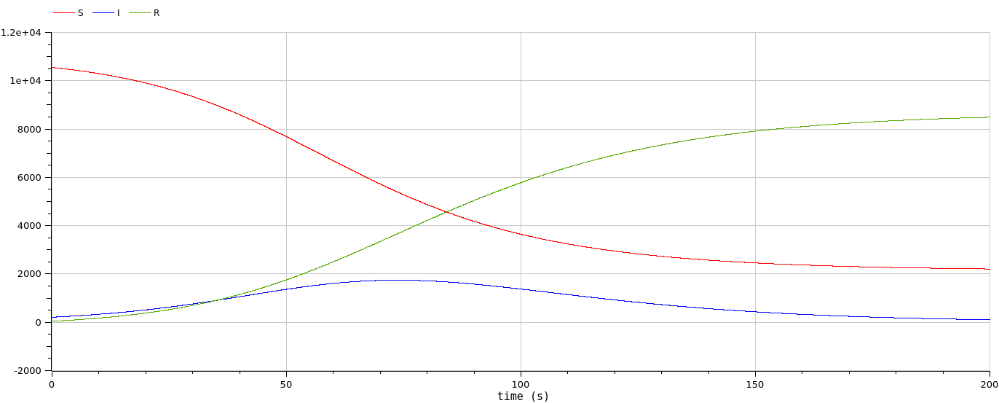
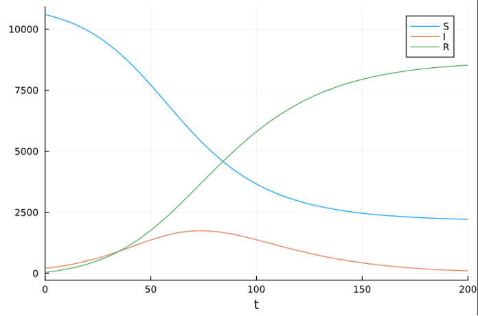
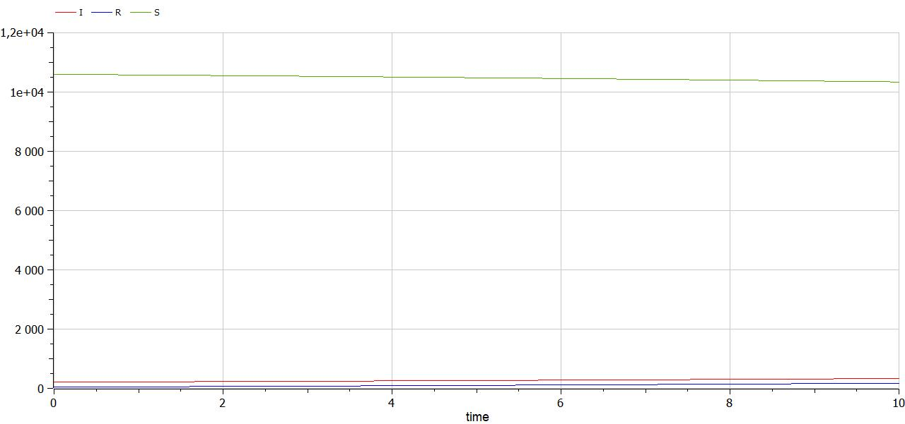
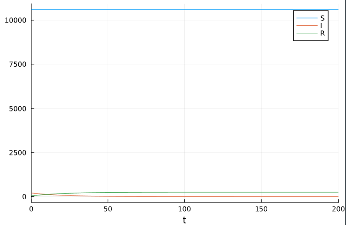

---
## Front matter
title: "Лабораторная работа №6"
subtitle: "Задача об эпидемии"
author: "Сунгурова Мариян Мухсиновна"

## Generic otions
lang: ru-RU
toc-title: "Содержание"

## Bibliography
bibliography: bib/cite.bib
csl: pandoc/csl/gost-r-7-0-5-2008-numeric.csl

## Pdf output format
toc: true # Table of contents
toc-depth: 2
lof: true # List of figures
lot: false # List of tables
fontsize: 12pt
linestretch: 1.5
papersize: a4
documentclass: scrreprt
## I18n polyglossia
polyglossia-lang:
  name: russian
  options:
	- spelling=modern
	- babelshorthands=true
polyglossia-otherlangs:
  name: english
## I18n babel
babel-lang: russian
babel-otherlangs: english
## Fonts
mainfont: PT Serif
romanfont: PT Serif
sansfont: PT Sans
monofont: PT Mono
mainfontoptions: Ligatures=TeX
romanfontoptions: Ligatures=TeX
sansfontoptions: Ligatures=TeX,Scale=MatchLowercase
monofontoptions: Scale=MatchLowercase,Scale=0.9
## Biblatex
biblatex: true
biblio-style: "gost-numeric"
biblatexoptions:
  - parentracker=true
  - backend=biber
  - hyperref=auto
  - language=auto
  - autolang=other*
  - citestyle=gost-numeric
## Pandoc-crossref LaTeX customization
figureTitle: "Рис."
tableTitle: "Таблица"
listingTitle: "Листинг"
lofTitle: "Список иллюстраций"
lotTitle: "Список таблиц"
lolTitle: "Листинги"
## Misc options
indent: true
header-includes:
  - \usepackage{indentfirst}
  - \usepackage{float} # keep figures where there are in the text
  - \floatplacement{figure}{H} # keep figures where there are in the text
---

# Цель работы

Исследовать простейшую математическую модель эпидемии(SIR).

# Задание

**Вариант 23**

На одном острове вспыхнула эпидемия. Известно, что из всех проживающих на острове ($N=10 850$) в момент начала эпидемии (t=0) число заболевших людей (являющихся распространителями инфекции) $I(0)=209$, А число здоровых людей с иммунитетом к болезни $R(0)=42$. Таким образом, число людей восприимчивых к болезни, но пока здоровых, в начальный момент времени $S(0)=N-I(0)- R(0)$. Постройте графики изменения числа особей в каждой из трех групп. Рассмотрите, как будет протекать эпидемия в случае:

1) если $I(0)<I^*$
2) если $I(0)>I^*$

# Теоретическое введение

**Задача об эпидемии**
Рассмотрим простейшую модель эпидемии. Предположим, что некая
популяция, состоящая из N особей, (считаем, что популяция изолирована)
подразделяется на три группы. Первая группа - это восприимчивые к болезни, но
пока здоровые особи, обозначим их через S(t). Вторая группа – это число
инфицированных особей, которые также при этом являются распространителями
инфекции, обозначим их I(t). А третья группа, обозначающаяся через R(t) – это
здоровые особи с иммунитетом к болезни.

# Выполнение лабораторной работы

## Программная реализация модели эпидемии

Зададим функцию для решения модели эпидемии. Возьмем интервал $t \in [0; 200]$ с начальными условиями $N=10 850$, \, I(0)=209$, \,R(0)=42 , \, S(0)=N-I(0)- R(0) . Зададим функции для случаев если $I(0)<I^*$ и если $I(0)>I^*$. Рассмотрим сначала реализацию в Julia. Зададим начальные условия и функции для двух случаев:


```julia

R = 42

I = 209

N = 10850

S = N-R-I

p = [0.1, 0.05]

u0 = [S,I,R]

tspan=(0.0,200.0)


```
Функции для решения случаев $I(0)>I^*$ и $I(0)<I^*$

```julia
function sir!(du,u,p,t)

    b,g = p

      S, I, R = u

      N = S+I+R

    du[1] = -b*u[2]*u[1]/N

    du[2] = b*u[2]*u[1]/N - g*u[2]

    du[3] = g*u[2]

end

 

function sir_0!(du,u,p,t)

    b,g = p

    du[1] = 0

    du[2] = - g*u[2]

    du[3] = g*u[2]

end

```
Для задания проблемы используется функция `ODEProblem`, а для решения -- численный метод Tsit5():

```julia
prob = ODEProblem(sir!,u0,tspan,p)

solution = solve(prob, Tsit5())

plot(solution, label=["S", "I", "R"])

 

problem = ODEProblem(sir_0!,u0,tspan,p)

solution = solve(problem, Tsit5())

plot(solution, label=["S", "I", "R"])

```

Также зададим эту модель в OpenModelica. Модель для $I(0)>I^*$:

```
model lab6

parameter Real N = 10850;
parameter Real b = 0.1;
parameter Real g = 0.05;

Real S(start = N - 209 - 42);
Real I(start = 209);
Real R(start = 42);

equation

der(S) = -b*S*I/N;
der(I) = b*S*I/N - g*I;
der(R) = g*I;

end lab6;
```

Модель случая $I(0)<I^*$:

```
model lab6_2
  parameter Real I_0 = 209;
  parameter Real R_0 = 42;
  parameter Real S_0 = 10599;
  parameter Real N = 10850;
  parameter Real b = 0.1;
  parameter Real c = 0.05;
  
  Real S(start=S_0);
  Real I(start=I_0);
  Real R(start=R_0);
  
equation
  der(S) = 0;
  der(I) = - c*I;
  der(R) = c*I;

end lab6_2;
```

## Графики решений

Посмотрим график изменения числа особей в каждой из трех групп при $I(0)<I^*$(рис. @fig:001,  @fig:002):

{#fig:001 width=70%}

{#fig:002 width=70%}

Графики решений, полученные с помощью OpenModelica и Julia идентичны. Можно увидеть, что число здоровых не изменяется, так как в этом случае все заражённые изолированы. При это заражённые выздоравливают и приобретают иммунитет.

Посмотрим график изменения числа особей в каждой из трех групп при $I(0)<I^*$(рис. @fig:003,  @fig:004):

{#fig:003 width=70%}

{#fig:004 width=70%}


# Выводы

Построили математическую модель эпидемии.

# Список литературы{.unnumbered}

::: {#refs}
:::