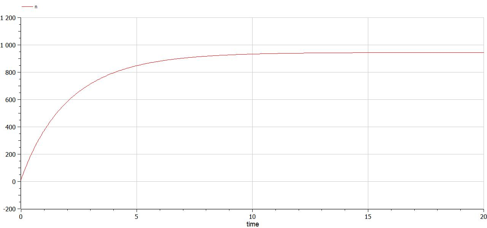
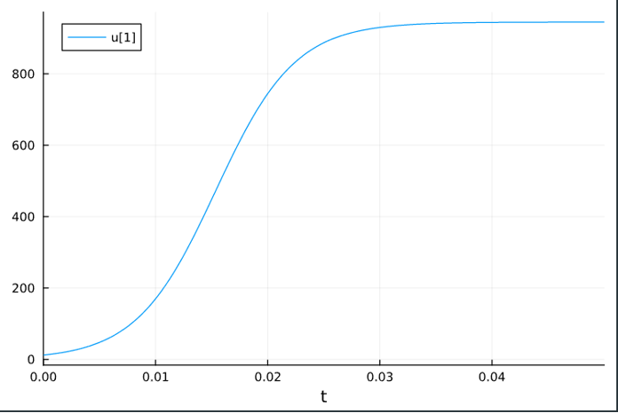
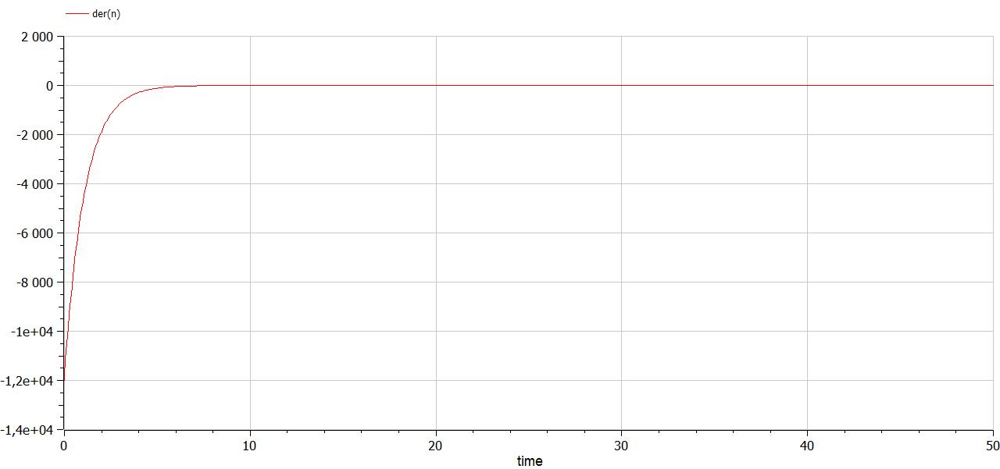
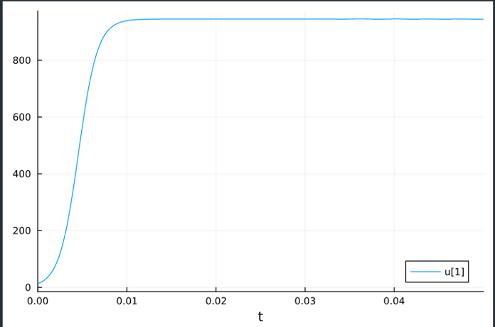
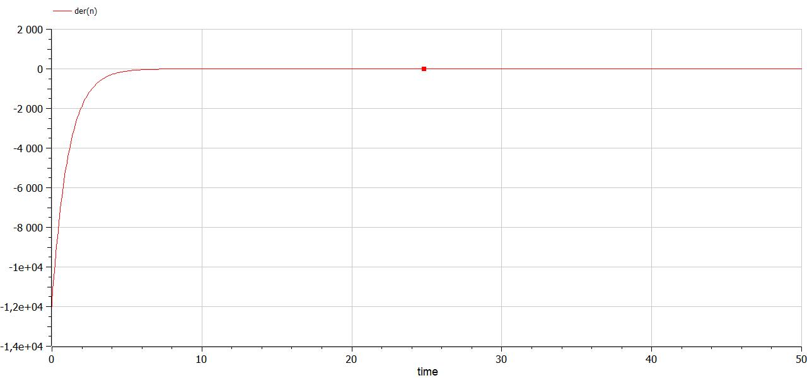
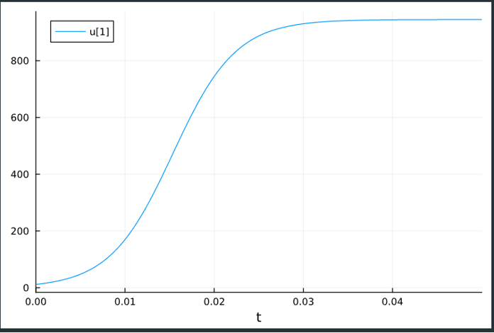

---
## Front matter
title: "Лабораторная работа №7"
subtitle: "Эффективность рекламы"
author: "Сунгурова Мариян М."

## Generic otions
lang: ru-RU
toc-title: "Содержание"

## Bibliography
bibliography: bib/cite.bib
csl: pandoc/csl/gost-r-7-0-5-2008-numeric.csl

## Pdf output format
toc: true # Table of contents
toc-depth: 2
lof: true # List of figures
lot: false # List of tables
fontsize: 12pt
linestretch: 1.5
papersize: a4
documentclass: scrreprt
## I18n polyglossia
polyglossia-lang:
  name: russian
  options:
	- spelling=modern
	- babelshorthands=true
polyglossia-otherlangs:
  name: english
## I18n babel
babel-lang: russian
babel-otherlangs: english
## Fonts
mainfont: PT Serif
romanfont: PT Serif
sansfont: PT Sans
monofont: PT Mono
mainfontoptions: Ligatures=TeX
romanfontoptions: Ligatures=TeX
sansfontoptions: Ligatures=TeX,Scale=MatchLowercase
monofontoptions: Scale=MatchLowercase,Scale=0.9
## Biblatex
biblatex: true
biblio-style: "gost-numeric"
biblatexoptions:
  - parentracker=true
  - backend=biber
  - hyperref=auto
  - language=auto
  - autolang=other*
  - citestyle=gost-numeric
## Pandoc-crossref LaTeX customization
figureTitle: "Рис."
tableTitle: "Таблица"
listingTitle: "Листинг"
lofTitle: "Список иллюстраций"
lotTitle: "Список таблиц"
lolTitle: "Листинги"
## Misc options
indent: true
header-includes:
  - \usepackage{indentfirst}
  - \usepackage{float} # keep figures where there are in the text
  - \floatplacement{figure}{H} # keep figures where there are in the text
---

# Цель работы

Исследовать простейшую математическую модель эффективности рекламы.

# Задание

**Вариант 23**

Постройте график распространения рекламы, математическая модель которой описывается следующим уравнением:

1. $\frac{dn}{dt} = (0.51 + 0.000099 (t)n(t))(N-n(t))$
2. $\frac{dn}{dt} = (0.0000019 + 0.99 (t)n(t))(N-n(t))$
3. $\frac{dn}{dt} = (0.99 + 0.3cos(4t)n(t))(N-n(t))$

При этом объем аудитории $N = 945$, в начальный момент о товаре знает $13$ человек. Для случая 2 определите в какой момент времени скорость распространения рекламы будет иметь максимальное значение.

# Теоретическое введение

Организуется рекламная кампания нового товара или услуги. Необходимо, чтобы прибыль будущих продаж с избытком покрывала издержки на рекламу. Вначале расходы могут превышать прибыль, поскольку лишь малая часть потенциальных покупателей будет информирована о новинке. Затем, при увеличении числа продаж, возрастает и прибыль, и, наконец, наступит момент, когда рынок насытиться, и рекламировать товар станет бесполезным.

Предположим, что торговыми учреждениями реализуется некоторая продукция, о которой в момент времениt из числа потенциальных покупателей $N$ знает лишь $n$ покупателей. Для ускорения сбыта продукции запускается реклама по радио, телевидению и других средств массовой информации. После запуска рекламной кампании информация о продукции начнет распространяться среди потенциальных покупателей путем общения друг с другом. Таким образом, после запуска рекламных объявлений скорость изменения числа знающих о продукции людей пропорциональна как числу знающих о товаре покупателей, так и числу покупателей о нем не знающих.

Модель рекламной кампании описывается следующими величинами. Считаем, что $\dfrac{dn}{dt}$ - скорость изменения со временем числа потребителей, узнавших о товаре и готовых его купить,$t$ - время, прошедшее с начала рекламной кампании, $n(t)$ - число уже информированных клиентов. Эта величина пропорциональна числу покупателей, еще не знающих о нем, это описывается следующим образом: $\alpha _1 (t)(N-n(t))$, где $N$ - общее число потенциальных платежеспособных покупателей, $\alpha _1 (t)$ - характеризует интенсивность рекламной кампании (зависит от затрат на рекламу в данный момент времени). Помимо этого, узнавшие о товаре потребители также распространяют полученную информацию среди потенциальных покупателей, не знающих о нем (в этом случае работает т.н. сарафанное радио). Этот вклад в рекламу описывается величиной $\alpha _2 (t)n(t)(N-n(t))$, эта величина увеличивается с увеличением потребителей узнавших о товаре. Математическая модель распространения рекламы описывается уравнением: 

$$
\frac{dn}{dt} = (\alpha _1 + \alpha _2 (t)n(t))(N-n(t))
$$

При $\alpha _1 > \alpha _2$ получается модель типа модели Мальтуса. При $\alpha_2 > \alpha_1$ получаем уравнение логистической кривой.

# Выполнение лабораторной работы

## Программная реализация модели эпидемии

Зададим функцию для решения модели эффективности рекламы. Возьмем интервал $t \in [0; 20]$ для первого сулчая и $t \in [0; 0.05]$ для второго и третьего, а также начальное условие $n0 = 12$ и параметры. Рассмотрим сначала реализацию в Julia. Зададим начальные условия и функции для трех случаев:


```julia
n0 = 12

p1 = [0.51, 0.000099, 945]

p2 = [0.000019, 0.99, 945]

p3 = [0.99, 0.3, 945]

tspan1 = (0,20)

tspan2 = (0,0.05)

f(n, p, t) = (p[1] + p[2]*n)*(p[3]-n)

 

f3(n, p, t) = (p[1]*t + p[2]*cos(4*t)*n)*(p[3]-n)


```

Для задания проблемы используется функция `ODEProblem`, а для решения -- численный метод Tsit5():

```julia
prob1 = ODEProblem(f, n0, tspan1, p1)

prob2 = ODEProblem(f, n0, tspan1, p2)

prob3 = ODEProblem(f3, n0, tspan2, p3)

 

sol1 = solve(prob1, Tsit5())

sol2 = solve(prob2, Tsit5())

sol3 = solve(prob3, Tsit5())
```

Также зададим эту модель в OpenModelica. Модель для первого случая:

```
model lab7

 

Real n(start=13);

 

parameter Real a1 = 0.51;

parameter Real a2 = 0.000099;

parameter Real N = 945;

 

 

equation

der(n) = (a1 - a2*n)*(N - n);

 

end lab7;
```

Также зададим эту модель в OpenModelica. Модель для второго случая:

```
model lab7

 

Real n(start=13);

 

parameter Real a1 = 0.51;

parameter Real a2 = 0.000099;

parameter Real N = 945;

 

 

equation

der(n) = (a1 - a2*n)*(N - n);

 

end lab7;
```

Также зададим эту модель в OpenModelica. Модель для третього случая:

```
model lab7

 

Real n(start=13);

 

parameter Real a1 = 0.99;

parameter Real a2 = 0.3;

parameter Real N = 945;

 

p = time;

q = cos(4*time);

 

equation

der(n) = (a1*p - a2*q*n)*(N - n);

 

end lab7;
```

## Посмтроение графиков решений и их анализ

Посмотрим график распространения рекламы для первого случая(рис. @fig:001,  @fig:002):

{#fig:001 width=70%}

{#fig:002 width=70%}

Графики решений, полученные с помощью OpenModelica и Julia идентичны. Можно увидеть, что распространение рекламы сначала быстро увеличивается, а затем перестает меняться.

Посмотрим график распространения рекламы для второго случая(рис. @fig:003,  @fig:004):

{#fig:003 width=70%}

{#fig:004 width=70%}

Графики решений, полученные с помощью OpenModelica и Julia идентичны. Можно увидеть, что распространение рекламы сначала быстро увеличивается, а затем перестает меняться.

Посмотрим график распространения рекламы для третьего случая(рис. @fig:005,  @fig:006):

{#fig:005 width=70%}

{#fig:006 width=70%}

Графики решений, полученные с помощью OpenModelica и Julia идентичны. Можно увидеть, что распространение рекламы сначала быстро увеличивается, а затем перестает меняться.


# Выводы

Построили математическую модель эффективности рекламы.

# Список литературы{.unnumbered}

::: {#refs}
:::