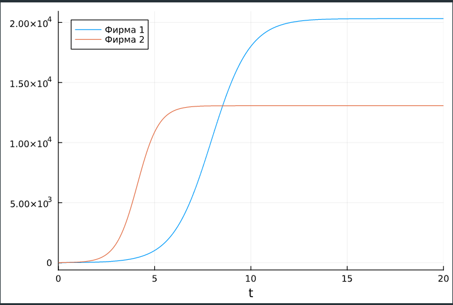
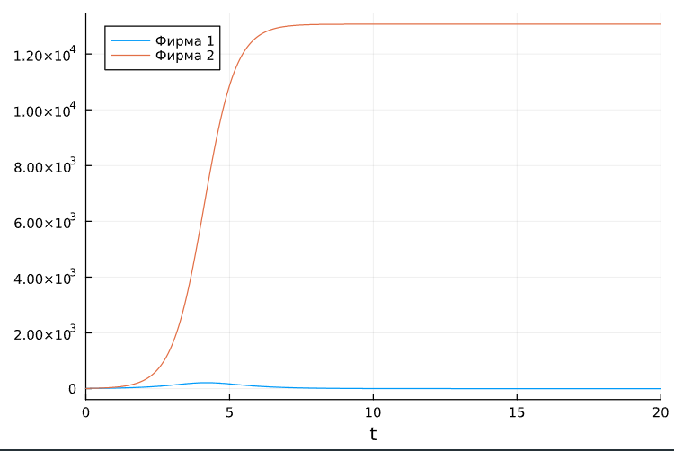
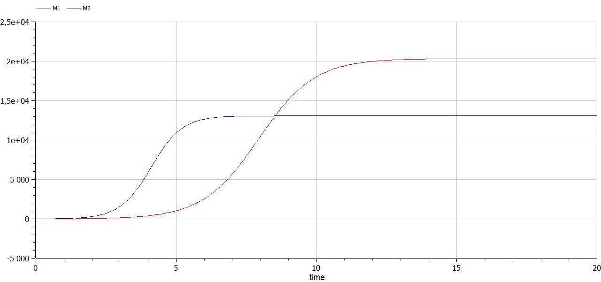
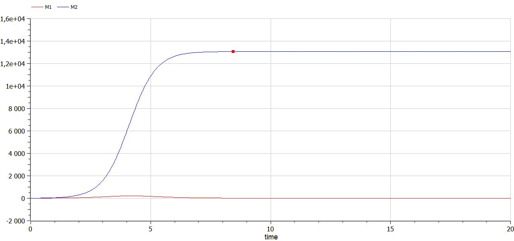

---
## Front matter
lang: ru-RU
title: Лабораторная работа №8
subtitle: Модель конкуренции двух фирм
author:
  - Сунгурова М. М.
institute:
  - Российский университет дружбы народов, Москва, Россия
date: 30 марта 2024

## i18n babel
babel-lang: russian
babel-otherlangs: english

## Formatting pdf
toc: false
toc-title: Содержание
slide_level: 2
aspectratio: 169
section-titles: true
theme: metropolis
header-includes:
 - \metroset{progressbar=frametitle,sectionpage=progressbar,numbering=fraction}
 - '\makeatletter'
 - '\beamer@ignorenonframefalse'
 - '\makeatother'
---

# Информация

## Докладчик

:::::::::::::: {.columns align=center}
::: {.column width="70%"}

  * Сунгурова Мариян Мухсиновна
  * студентка группы НКНбд-01-21
  * Российский университет дружбы народов

:::
::: {.column width="30%"}


:::
::::::::::::::

# Вводная часть

## Цели 

Исследовать простейшую математическую модель конкуренции двух фирм.

## Формулировка задачи

**Вариант 23**

**Случай 1.** Рассмотрим две фирмы, производящие взаимозаменяемые товары одинакового качества и находящиеся в одной рыночной нише. Считаем, что в рамках нашей модели конкурентная борьба ведётся только рыночными методами. То есть, конкуренты могут влиять на противника путем изменения параметров своего производства: себестоимость, время цикла, но не могут прямо вмешиваться в ситуацию на рынке («назначать» цену или влиять на потребителей каким-либо иным способом.) Будем считать, что постоянные издержки пренебрежимо малы, и в модели учитывать не будем. В этом случае динамика изменения объемов продаж фирмы 1 и фирмы 2 описывается следующей системой уравнений:

## Формулировка задачи

$$\begin{cases}
\frac{d M_1}{d \theta} = M_1 - \dfrac{b}{c_1} M_1 M_2 - \dfrac{a_1}{c_1} M_1^2,\\
\frac{d M_2}{d \theta} = \dfrac{c_2}{c_1} M_1 - \dfrac{b}{c_1} M_1 M_2 - \dfrac{a_2}{c_1} M_2^2,
\end{cases}$$

где $a_1 = \dfrac{p_{cr}}{(\tau _1^2 \tilde{p_1} N q)}$, $a_2 = \dfrac{p_{cr}}{(\tau _2 ^2*\tilde{p_2} N q)}$, $b = \dfrac{p_{cr}}{(\tau _1^2 \tau _2^2 \tilde{p_1}^2 \tilde{p_2}^2 N q)}$,
$c_1 = \dfrac{(p_{cr}-p_1)}{(\tau _1 \tilde{p_1})}$, $c_2 = \dfrac{(p_{cr}-p_2)}{(\tau _2 \tilde{p_2})}$.

## Формулировка задачи

Также введена нормировка $t = c_1 \theta$.

**Случай 2.** Рассмотрим модель, когда, помимо экономического фактора влияния (изменение себестоимости, производственного цикла, использование кредита и т.п.), используются еще и социально-психологические факторы -- формирование общественного предпочтения одного товара другому, не зависимо от их качества и цены. В этом случае взаимодействие двух фирм будет зависеть друг от друга, соответственно коэффициент перед1 $M_1 M_2$ будет отличаться. Пусть в рамках рассматриваемой модели динамика изменения объемов продаж фирмы 1 и фирмы 2 описывается следующей системой уравнений:

## Формулировка задачи

$$\begin{cases}
\frac{d M_1}{d \theta} = M_1 - (\dfrac{b}{c_1} + 0.00014) M_1 M_2 - \dfrac{a_1}{c_1} M_1^2,\\
\frac{d M_2}{d \theta} = \dfrac{c_2}{c_1} M_1 - \dfrac{b}{c_1} M_1 M_2 - \dfrac{a_2}{c_1} M_2^2,
\end{cases}$$

Для обоих случаев рассмотри задачу со следующими начальными условиями: $M_0^1 = 7.1$, $M_0^2 = 8.1$.

И параметрами:  $p_{cr} =43$, $N =87$, $q = 1 $, $\tau_{1} = 27$, $\tau_2 = 20$, $\tilde p_1 = 12$,$\tilde p_1 = 9.7$ 

## Формулировка задачи

- $N$ -- число потребителей производимого продукта.
- $\tau$ -- длительность производственного цикла
- $p$ -- рыночная цена товара
- $\tilde p$ -- себестоимость продукта, то есть переменные издержки на производство единицы продукции.
- $q$ -- максимальная потребность одного человека в продукте в единицу времени 
- $\theta = \dfrac{t}{c_1}$ -- безразмерное время

1. Постройте графики изменения оборотных средств фирмы 1 и фирмы 2 без учета постоянных издержек и с веденной нормировкой для случая 1.
2. Постройте графики изменения оборотных средств фирмы 1 и фирмы 2 без учета постоянных издержек и с веденной нормировкой для случая 2.

## Материалы и методы

- Язык программирования `Julia` 
- Библиотеки
	- `OrdinaryDiffEq`
	- `Plots`
- Язык программирования `OpenModelica` 

# Выполнение лабораторной работы

##  Julia. Программная реализация модели

Зададим функцию для решения модели эффективности рекламы. Возьмем интервал $t \in [0; 20]$. Рассмотрим сначала реализацию в Julia. Зададим начальные условия и функции для двух случаев:

```julia
p_cr = 43 
tau1 = 27
p1 = 12  #себестоимость продукта у фирмы 1
tau2 = 20 #длительность производственного цикла фирмы 2
p2 = 9.7 #себестоимость продукта у фирмы 2
N = 87 #число потребителей производимого продукта
q = 1 #максимальная потребность одного человека в продукте в единицу времени
a1 = p_cr/(tau1*tau1*p1*p1*N*q)
a2 = p_cr/(tau2*tau2*p2*p2*N*q)
b = p_cr/(tau1*tau1*tau2*tau2*p1*p1*p2*p2*N*q)
c1 = (p_cr-p1)/(tau1*p1)
c2 = (p_cr-p2)/(tau2*p2)
```

##  Julia. Программная реализация модели
```julia
constant1 = 0
constant2 = 0.00014
p1 = [a1,a2,b,c1,c2,constant1]
p2 = [a1,a2,b,c1,c2,constant2]

tspan = (0, 20)
u0=[7.2;8.2]

function syst(du,u,p,t)
    a1, a2, b, c1, c2, constant = p
    du[1] = u[1] - (a1/c1)*u[1]*u[1] - (b/c1+constant)*u[1]*u[2]
    du[2] = (c2/c1)*u[2] - (a2/c1)*u[2]*u[2] - (b/c1)*u[1]*u[2]
end
```

## Julia. Программная реализация модели

Для задания проблемы используется функция `ODEProblem`, а для решения -- численный метод Tsit5():

```julia
prob1 = ODEProblem(syst, u0, tspan, p1)
solution1 = solve(prob1, Tsit5(), saveat = 0.001)
plot(solution1, labels = ["Фирма 1" "Фирма 2"])

prob2 = ODEProblem(syst, u0, tspan, p2)
solution2 = solve(prob2, Tsit5(), saveat = 0.001)
plot(solution2, labels = ["Фирма 1" "Фирма 2"])
```

## Графики

{#fig:001 width=80%}

## Графики

{#fig:001 width=80%}


## OpenModelica. Программная реализация модели

Также зададим эту модель в OpenModelica. Модель для первого случая:

```
model lab8

Real M1(start=7.2);
Real M2(start=8.2);

parameter Real p_cr = 43 ; //критическая стоимость продукта
parameter Real tau1 = 27; //длительность производственного цикла фирмы 1
parameter Real p1 = 12; //себестоимость продукта у фирмы 1
parameter Real tau2 = 20; //длительность производственного цикла фирмы 2
parameter Real p2 = 9.7; //себестоимость продукта у фирмы 2
parameter Real N = 87; //число потребителей производимого продукта
parameter Real q = 1; //максимальная потребность одного человека в продукте в единицу времени
```
## OpenModelica. Программная реализация модели

```
parameter Real a1 = p_cr/(tau1*tau1*p1*p1*N*q);
parameter Real a2 = p_cr/(tau2*tau2*p2*p2*N*q);
parameter Real b = p_cr/(tau1*tau1*tau2*tau2*p1*p1*p2*p2*N*q);
parameter Real c1 = (p_cr-p1)/(tau1*p1);
parameter Real c2 = (p_cr-p2)/(tau2*p2);

equation
der(M1) = (c1/c1)*M1 - (a1/c1)*M1*M1 - (b/c1)*M1*M2;
der(M2) = (c2/c1)*M2 - (a2/c1)*M2*M2 - (b/c1)*M1*M2;


end lab8;
```

## OpenModelica. Программная реализация модели

Модель для второго случая:

```
model lab8

Real M1(start=7.2);
Real M2(start=8.2);

parameter Real p_cr = 43 ; //критическая стоимость продукта
parameter Real tau1 = 27; //длительность производственного цикла фирмы 1
parameter Real p1 = 12; //себестоимость продукта у фирмы 1
parameter Real tau2 = 20; //длительность производственного цикла фирмы 2
parameter Real p2 = 9.7; //себестоимость продукта у фирмы 2
parameter Real N = 87; //число потребителей производимого продукта
parameter Real q = 1; //максимальная потребность одного человека в продукте в единицу времени
```
## OpenModelica. Программная реализация модели
```
parameter Real a1 = p_cr/(tau1*tau1*p1*p1*N*q);
parameter Real a2 = p_cr/(tau2*tau2*p2*p2*N*q);
parameter Real b = p_cr/(tau1*tau1*tau2*tau2*p1*p1*p2*p2*N*q);
parameter Real c1 = (p_cr-p1)/(tau1*p1);
parameter Real c2 = (p_cr-p2)/(tau2*p2);

equation
der(M1) = (c1/c1)*M1 - (a1/c1)*M1*M1 - (b/c1 + 0.00014)*M1*M2;
der(M2) = (c2/c1)*M2 - (a2/c1)*M2*M2 - (b/c1)*M1*M2;

end lab8;
```

## Графики

{#fig:001 width=80%}

## Графики

{#fig:002 width=70%}


# Выводы

Построили математическую модель конкуренции двух фирм.

# Список литературы

1. Малыхин В.И. Математическое моделирование экономики. М., УРАО, 1998. 160 с.