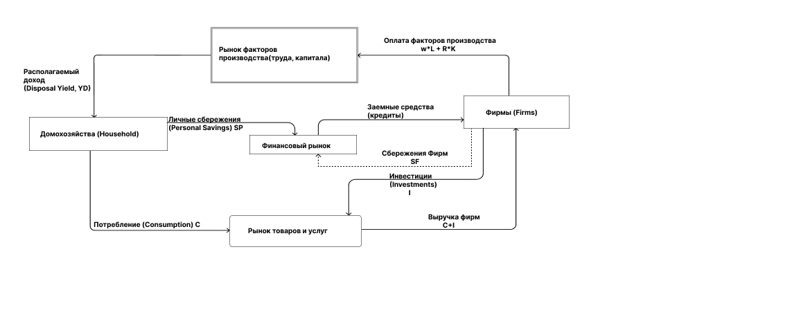
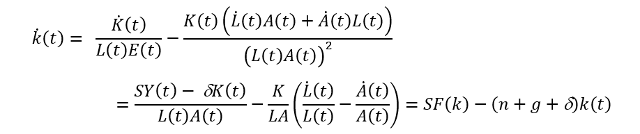
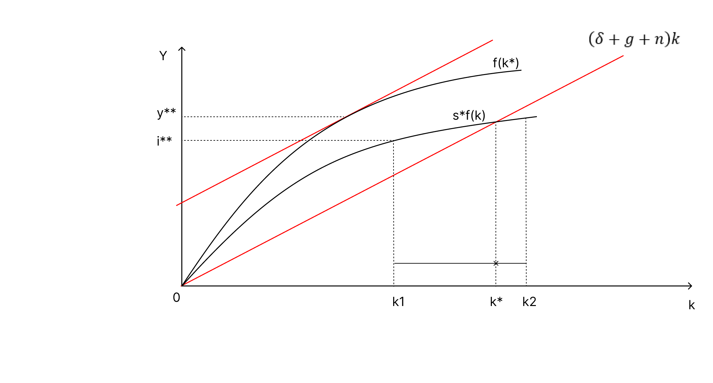

---
## Front matter
lang: ru-RU
title: Презентация к докладу
subtitle: Модель экономического роста Солоу
author:
  - Сунгурова Мариян М.
institute:
  - Российский университет дружбы народов, Москва, Россия
date: 23 февраля 2024

## i18n babel
babel-lang: russian
babel-otherlangs: english

## Formatting pdf
toc: false
toc-title: Содержание
slide_level: 2
aspectratio: 169
section-titles: true
theme: metropolis
header-includes:
 - \metroset{progressbar=frametitle,sectionpage=progressbar,numbering=fraction}
 - '\makeatletter'
 - '\beamer@ignorenonframefalse'
 - '\makeatother'
---

# Информация

## Докладчик

:::::::::::::: {.columns align=center}
::: {.column width="70%"}

  * Сунгурова Мариян Мухсиновна
  * студентка группы НКНбд-01-21
  * Российский университет дружбы народов

:::
::: {.column width="30%"}

:::
::::::::::::::

# Вводная часть

## Цели 

Рассмотреть модель экономического роста Солоу.

## Теоретическое введение
Роберт Мертон Со́лоу — американский экономист, автор модели Солоу, лауреат Нобелевской премии 1987 года «за фундаментальные исследования в области теории экономического роста».

## Введение

**Основной вопрос теории экономического роста.**

**Как объяснить различия в уровне жизни между странами в текущий момент времени и в исторической перспективе?** Начинаем искать ответ не с глубинных причин, а с тех, которые лежат на поверхности. Объемы производства товаров и услуг разные, потому что: 
   1. Численность населения разная 
   2. Запас средств производства (капитала) и природных ресурсов различен 
   3. Уровень технологий, знаний и навыков различается 
   4. Уровень инфраструктуры и организации различается

## Введение

Объем ВВП экономики (Y) зависит от количества рабочих (часов) (L), запаса средств производства (капитала) (K) и уровня технологий, знаний (A) Производственная функция ставит в соответствие факторам производства объем созданной добавленной стоимости
$$ Y = F(K, L, A) $$
Свойства производственной функции
1. Факторы производства необходимы $ F(0, L, A) = F(K, 0, A) = 0 $
2. Предельный продукт труда, капитала, знаний положителен 
3. Выполнен закон убывающей предельной производительности

## Введение

Производственная функция обладает свойством постоянной отдачи от масштаба по труду и капиталу
$$ F(\lambda K, \lambda L, A) = \lambda F(K, L, A)$$

Продифференцировав уравнение по $\lambda$, получим, что для производственной функции c постоянной отдачей от масштаба по труду и капиталу выполнено:
$$ F(K, L, A) = F'_{L}L +F'_{K}K $$

# Выполнение лабораторной работы

##  Капитал. Свойства капитала (K)
1. Используется в процессе производства, но не расходуется полностью в рамках производственного цикла 
2. Обладает ценностью, рыночной стоимостью. Как следствие, может быть перепродан или использован в виде закладной 

Капитал - часть совокупного богатства нации (в модели Солоу единственный вид богатства)

**В модели Солоу рассматривается закрытая экономика**. Фирмы максимизируют свою прибыль. Фирмы функционируют в условиях совершенной конкуренции. Темпы технологического прогресса g, роста населения n и норма выбытия капитала $\delta$ -- постоянны. Время изменяется непрерывно. 

## Задача фирмы
В рыночной экономике производство осуществляется частными компаниями (фирмами). Фирмы принадлежит владельцам (акционерам), которые заинтересованы в максимизации ее стоимости, т.е максимизации дисконтированного потока прибылей от ее деятельности.

В модели Солоу задача максимизации стоимости компании эквивалентна задачи максимизации прибыли в каждый момент времени.

Фирмы оплачивают стоимость труда (wL), где w- заработная плата и арендную стоимость капитала (плата за единицу аренды капитала) $((r + \delta)K)$, где r- процентная ставка, $\delta$ - норма износа капитала (амортизация)(стоимостная оценка износа основного капитала за определенный период времени).

$$max{K, L}({Y - wL - (r + \delta)K})$$
где $Y = F(K, L, A)$

## Задача фирмы

Предположим, что рынки товаров и факторов производства являются конкурентными

Цены ресурсов совпадают с предельным продуктом от их использования(Цены на ресурсы совпадают с предельным продуктом их использования на конкурентном рынке, когда рынок находится в равновесии. Предельный продукт использования ресурсов – дополнительный выпуск или результат, полученный за счет использования еще одной единицы ресурса при сохранении других ресурсов постоянными.), так как рынки конкурентные и выполнено свойство СRS(свойство постоянной отдачи от масштаба по труду и капиталу), получим, что:
$$ Y = wL + (r + \delta)K $$

Весь ВВП полностью расходуется на оплату доходов труда и капитала, прибыль равна нулю.

## Задача домашнего хозяйства
Домохозяйство (households) – обладает единым бюджетом (доходами и расходами).

В рыночной экономике домашние хозяйства являются собственниками факторов производства (труда и капитала) и получают доходы от их использования
$$Y = wL + (r + \delta)K$$

Домашние хозяйства распределяют располагаемый доход между потреблением (C(t)) и личными сбережениями (SP(t)).

Потребление (C) – расходы домохозяйств на покупку 
1) товаров текущего потребления 
2) товаров длительного пользования 
3) услуг
   
## Задача домашнего хозяйства

В модели Солоу предполагается, что фиксированная доля дохода s идет на сбережения. 
$$ SP(t) = SY(t) $$

В двухсекторной экономике (домохозяйств и фирм) все что производится, тратится на потребление (C) и инвестиции(включая инвестиции в запасы) (I). 
$$ Y (t) ≡ C(t) + I(t) $$

## Схема

{#fig:003 width=70%}

## Основное уравнение динамики в модели Солоу

$k = \dfrac{K}{LA}$ - **капиталовооруженность труда**, где L(t) – труд, K(t) – капитал и A(t) – параметр технологического процесса в момент времени . 

В момент времени t капитал увеличивается на величину инвестиций, то есть на I(t), и изнашивается на $\delta K(t)$, таким образом, можно записать производную капитала по времени  $\dot{K}{(t)}$ в следующем виде:
$$\dot{K}{(t)} = I(t) - \delta K(t)$$

I(t) - инвестиции в капитал, К(t) - запас капитала, $\delta$ - норма амортизации 

## Основное уравнение динамики в модели Солоу

Темпы роста населения и технологического прогресса постоянные:

$\dfrac{\dot L}{L} = n = const$

$\dfrac{\dot A}{A} = g = const$

## Основное уравнение динамики в модели Солоу

Тогда

{#fig:001 width=50%}

где $\dot L(t)$ – производная труда по времени,  $\dot A(t)$- производная эффективности труда по времени. Если инвестиции на единицу эффективного труда SF(k) превышают выбытие капитала на единицу активного труда $(n+g+\delta)k(t)$ то капиталовооруженность труда с постоянной эффективностью k растет, в противном случае – падает. 

## Равновесное состояние в модели Солоу

 В стационарном состоянии уровень капитала на единицу эффективного труда k постоянен, т.е.  $\dot k(t) = 0$
 
Значит устойчивый уровень капиталовооруженности труда с постоянной эффективностью k* находится из уравнения :
$$ SF(k^*) = (n+g+\delta)k^* $$

## Равновесное состояние в модели Солоу

{#fig:002 width=50%}

$y^{**}$ - стационарный уровень ВВП на душу населения 

$i^{**}$ - стационарный уровень инвестиций на одного работника 

$c^{**} = y^{**} − i^{**}$- стационарный уровень потребления на душу населения

## Равновесное состояние в модели Солоу

При росте нормы сбережений инвестиции превышают выбытие капитала, k растет до достижения равновесия.

При расположении капитала в точке k1 < k, инвестиции превышают выбытие капитала, значит капиталовооруженность будет увеличиваться, пока не достигнет уровня k. 

Если же запасы в точке k2>k, то инвестиции меньше, чем выбытие, и запасы будут снижаться, пока не приблизятся к точке k. 

Важно понимать, что в каком бы положении ни находилась экономика государства, она всегда будет стремиться к стационарному (устойчивому) состоянию.

Если параметр A постоянный, рост доходов на душу населения в долгосрочном периоде равен 0. 

## Равновесное состояние в модели Солоу

**Устойчивый рост возможен лишь в случае устойчивого роста параметра A - технического прогресса.**

**Влияют ли инвестиции на рост?**

Графически **«Золотое правило»**(или иными словами оптимальный уровень нормы сбережения) в модели Солоу показано на иллюстрации. Выбирается такая норма сбережений, при которой наклон кривой f(k*) равен $(n+g+\delta)k$, поскольку именно в этой точке превышение кривой f(k*) над кривой $(n+g+\delta)k$ которое и составляет потребление c, максимально. 

## Равновесное состояние в модели Солоу

Таким образом, норма сбережений, обеспечивающая максимальный устойчивый уровень потребления, равна эластичности выпуска по капиталу в устойчивом состоянии, соответствующему этой норме сбережений. Полученное значение s** называют «Золотым правилом» нормы сбережения

# Выводы

Разработанная Солоу модель экзогенного экономического рост объясняет важность инноваций и технического прогресса и рассматривает экономический рост как результат действия трех движущих сил – труда, капитала и технологий. 

Однако если ресурсы труда и капитала ограничены, то вклад технологий в рост безграничен. Только технологический прогресс может дать больший объем ВВП при заданном количестве труда и капитала. 

# Список литературы{.unnumbered}

::: {#refs}
::: 
1. модель Солоу [Электронный ресурс]. Wikimedia Foundation, Inc., 2024. URL: https://ru.wikipedia.org/wiki/%D0%9C%D0%BE%D0%B4%D0%B5%D0%BB%D1%8C_%D0%A1%D0%BE%D0%BB%D0%BE%D1%83
2. Дмитрий Александрович Веселов, Кафедра макроэкономического анализа НИУ ВШЭ, Лекции 2. Модели рыночной экономики: модель Солоу и модель кругооборота. Роль государства в экономике 2014
3. Модель Солоу [Электронный ресурс]. Econs.online, 2023. URL: https://econs.online/articles/ekonomika/robert-solou-sosushchestvovanie-kraynego-bogatstva-i-krayney-nishchety-kazhetsya-mne-amoralnym/
4. Л.Притчина, Ю.Кавин, ИССЛЕДОВАНИЕ ЭКОНОМИЧЕСКОГО РОСТА С ИСПОЛЬЗОВАНИЕМ МОДЕЛИ СОЛОУ В ПРОГРАММНОЙ СРЕДЕ SIMULINK
5. Конозова А.В., Модель экономического роста Р.Солоу (Model of economic growth of R. Solow)
